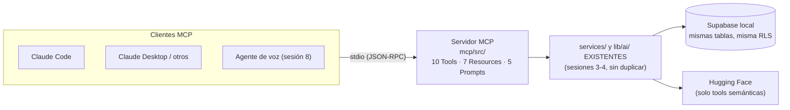

# MercadoTech — Sesión 5: Custom Skills y Protocolo MCP

## Este documento contiene la especificación completa de la sesión. Léelo completamente antes de generar cualquier código. No hagas suposiciones fuera de lo especificado.

**Prompts de la sesión (ejecutar en orden; versión completa y autocontenida de cada uno en `PROMPTS_sesion5.md`):**

0. "Ejecuta el Prompt 0 de `PROMPTS_sesion5.md`: verifica el estado del repo tras la sesión 4 e instala las dependencias del servidor MCP."
1. "Lee `mercadotech/MercadoTech_sesion5.md` completo y confírmame que entiendes el alcance. No generes código todavía."
2. "Ejecuta la Fase 5.1: crea las 4 Skills de gobernanza del proyecto."
3. "Ejecuta la Fase 5.2: scaffolding del servidor MCP."
4. "Ejecuta la Fase 5.3: implementa las Tools del servidor MCP."
5. "Ejecuta la Fase 5.4: implementa los Resources y Prompts del servidor MCP."
6. "Ejecuta la Fase 5.5: registra y valida el servidor MCP."
7. "Ejecuta la Fase 5.6: corre las Skills sobre el código de las sesiones 2–4 y corrige los hallazgos."
8. "Ejecuta el Prompt de cierre de `PROMPTS_sesion5.md`: bitácora de la sesión en `docs/BITACORA.md` y actualización de `CLAUDE.md`."

---

## Objetivo general

Extender Claude Code con conocimiento propio del proyecto: cuatro **Skills** que
hacen cumplir la arquitectura y la calidad de MercadoTech, y un **servidor MCP**
que expone la plataforma (solo lectura) a cualquier cliente MCP, reutilizando
los services existentes sin duplicar lógica.

## Objetivos específicos

* Comprender la extensión del modelo mediante Skills.
* Crear un servidor MCP para conectar Claude al entorno de MercadoTech.
* Desarrollar Skills personalizadas (enforcement, revisión, validación, tech lead).
* Aplicar lógica de validación automática sobre el código ya escrito (lab del
  curso: ejecutar la Skill "Tech Lead" y corregir malas prácticas detectadas).

---

## Qué vas a construir, en palabras simples

En esta sesión no se agrega ninguna pantalla a la tienda. Se construyen **dos
cosas para las máquinas que trabajan con la tienda**:

**1. Cuatro "manuales de puesto" para Claude Code (las Skills).** Hasta ahora,
cada vez que Claude trabaja en MercadoTech, las reglas del proyecto viven en
`CLAUDE.md` y en tu memoria. Una Skill es un manual que Claude consulta en el
momento justo, cada uno con un rol distinto — como los roles de una obra:

| Skill | Rol en la obra | Cuándo actúa |
|---|---|---|
| `architecture-enforcer` | **Inspector de permisos de obra**: ¿este muro puede ir aquí? | ANTES de crear o mover archivos |
| `code-reviewer` | **Revisor**: informe con nota, errores y sugerencias | DESPUÉS de escribir, sobre el código |
| `automatic-validator` | **Portero binario**: pasa o no pasa, sin "casi" | Al cerrar una tarea o fase |
| `tech-lead` | **Arquitecto jefe**: juicio de diseño, no checklist | Ante decisiones de diseño o deuda |

**2. Un "mostrador de atención para asistentes de IA" (el servidor MCP).** Hoy,
la única forma de usar MercadoTech es su página web. MCP (*Model Context
Protocol*) es un protocolo estándar — piensa en un enchufe universal — para que
cualquier asistente de IA (Claude Code, Claude Desktop, u otro cliente MCP) se
conecte a un sistema y lo use SIN tocar su código. El mostrador ofrece tres
tipos de servicio:

* **Tools** = trámites que el asistente puede pedir ("busca laptops bajo
  S/ 3,500", "compara estos dos productos").
* **Resources** = folletos que puede leer (el catálogo, la FAQ, las estadísticas),
  cada uno con su URI estable (`mercadotech://products`).
* **Prompts** = formularios pre-redactados para tareas frecuentes ("redacta la
  ficha de este producto").

La regla de oro: el mostrador **no cocina nada nuevo** — todo lo que sirve sale
de la misma cocina que ya usa la web (los `services/` y `lib/ai/` de las
sesiones 3 y 4). Si una tool necesitara lógica nueva, la sesión está mal hecha.

### Glosario mínimo

| Término | En una línea |
|---|---|
| Skill (Claude Code) | Carpeta `.claude/skills/<nombre>/SKILL.md` con instrucciones que Claude carga cuando la tarea coincide con su descripción. Es texto, no código. |
| MCP | Protocolo estándar para conectar asistentes de IA a sistemas externos. |
| Servidor MCP | El programa que atiende el mostrador (aquí: `mcp/`, un proceso Node aparte de la web). |
| Cliente MCP | Quien consume el mostrador (Claude Code, Claude Desktop, el Inspector…). |
| Tool | Acción invocable con parámetros tipados; puede tener efectos (aquí: todas de solo lectura). |
| Resource | Contenido direccionable por URI que el cliente lee (como un archivo o una página). |
| Prompt (MCP) | Plantilla parametrizada de instrucción que el servidor ofrece. **NO es una Skill de Claude Code ni el "prompt" que escribes en el chat** — trampa de nombres documentada en ReadHub. |
| stdio | Transporte: el cliente lanza el servidor como proceso hijo y conversan por stdin/stdout. |
| JSON-RPC | El formato de esos mensajes. Por eso stdout es sagrado: un `console.log` lo corrompe. |
| zod | Librería para declarar y validar la forma de los inputs de cada tool. |
| MCP Inspector | Herramienta oficial con interfaz web para probar un servidor MCP sin necesitar a Claude. |
| `.mcp.json` | Archivo en la raíz del repo que le dice a Claude Code qué servidores MCP tiene este proyecto. |

---

## Guía de lecciones heredadas de ReadHub (léela antes de las Fases 5.2–5.4)

ReadHub ya construyó su servidor MCP (`apps/mcp/`) y sus Skills; estas lecciones
salen de su código y README reales, más lo ya comprobado en ESTE repo. Son
decisiones CERRADAS:

1. **Las Skills se commitean.** En ReadHub quedaron sin versionar y se
   perdieron del historial. Aquí `.claude/skills/` entra al repo desde el
   primer commit de la Fase 5.1.
2. **"Prompts" de MCP ≠ "Skills" de Claude Code.** Mismo curso, dos conceptos:
   la Skill vive en `.claude/skills/` y la carga Claude Code; el Prompt MCP
   vive en el servidor y lo ofrece el protocolo. No mezclarlos ni en el código
   ni en la documentación.
3. **stdout es sagrado.** Con transporte stdio, stdout transporta JSON-RPC:
   un solo `console.log` rompe la conexión. Primera línea de `src/index.ts`:
   redirigir `console.log`/`console.info`/`console.warn` a `stderr`.
4. **zod pineado.** El SDK 1.x no es compatible con zod 4: ReadHub funciona
   con `@modelcontextprotocol/sdk ^1.29.0` + `zod ^3.25.76` + `tsup ^8.5.1`.
   Usar esas versiones; si se actualiza el SDK, verificar compatibilidad
   contra su changelog antes.
5. **Contexto POR LLAMADA, no al arranque.** Los clientes de Supabase se crean
   en cada invocación de tool (fábrica en `src/context.ts`), no como singleton
   al iniciar el proceso: el servidor puede vivir horas y las credenciales/
   conexiones no deben quedar congeladas.
6. **Reutilizar, no reimplementar.** Cada tool/resource/prompt llama a
   `services/*` y `lib/ai/*` existentes. Cuando algo no existe como service
   (ej. estadísticas agregadas), se DERIVA componiendo services existentes en
   `mcp/src/shared/` y se documenta como derivación — jamás una consulta de
   negocio nueva "porque era más corto" (así lo resolvió ReadHub con
   `authors`/`stats`).
7. **`resources/list` nunca falla completo.** Cada resource captura sus
   propios errores y devuelve algo útil; un resource caído no puede tumbar el
   listado entero.
8. **`server-only` revienta bajo Node puro — comprobado en ESTE repo.**
   `lib/supabase/admin.ts` importa `"server-only"`, un guard que solo el
   bundler de Next neutraliza; bajo `tsx`/Node lanza siempre (está documentado
   en la cabecera de `scripts/index-all.ts`, que sufrió exactamente esto en la
   sesión 4). El MCP construye sus propios clientes con
   `@supabase/supabase-js` — mismo patrón que `index-all.ts`.
9. **Node no lee `.env.local` solo.** Next la carga automáticamente; un
   proceso Node no. `index-all.ts` la parsea a mano (`loadEnvLocal`); el MCP
   reutiliza ese mismo patrón y la MISMA `.env.local` de la raíz — una sola
   fuente de credenciales, sin duplicar secretos.

---

## Estado de partida (validar con el Prompt 0 antes de empezar)

| Verificado (2026-08-26) | Detalle | Lo usa la fase |
|---|---|---|
| Sesiones 2, 3 y 4 ejecutadas y commiteadas | `docs/BITACORA.md` al día; 2.6/2.7 TAMBIÉN hechas (la bitácora lo confirma, commits `feccd12`/`fb419eb`) | todas |
| 15 services + `lib/ai/` completo | `services/*.service.ts`, `lib/ai/{embeddings,completion,prompts,context-builder}.ts` | 5.3, 5.4 |
| `product.service.getProductsByIds` ya existe | insumo directo de `compare_products` | 5.3 |
| `chat.service.ask(query, mode)` con modos `compras`/`soporte` | insumo de `ask_assistant` | 5.3 |
| `.claude/` existe pero SIN skills (solo `launch.json`) | la Fase 5.1 crea `.claude/skills/` | 5.1 |
| `tsx` instalado (devDependency raíz) | corre el servidor en dev | 5.2, 5.5 |
| FALTAN: `@modelcontextprotocol/sdk`, `zod`, `tsup` | el `sdk` que aparece en `node_modules` es transitivo de shadcn — NO cuenta | 0 |
| `scripts/index-all.ts` con `loadEnvLocal` y admin propio | patrón a reutilizar en `src/context.ts` (lecciones 8 y 9) | 5.2 |
| Deuda técnica documentada en la bitácora (S3/S4) | `public_profiles` inexistente, stock en cancelación, multi-vendedor, `ilike`, vulnerabilidades transitivas de Next | 5.3, 5.6 |
| Sesión 1 no ejecutada | sin `docs/COSTOS.md`; modelo sugerido por fase vive en `PROMPTS_sesion5.md` | — |

### Decisiones tomadas al validar la spec contra el repo

| # | Hallazgo | Resolución | Fase |
|---|---|---|---|
| 1 | `lib/supabase/admin.ts` importa `server-only` → inutilizable desde el MCP (lección 8, comprobada en la sesión 4) | `src/context.ts` construye sus clientes con `@supabase/supabase-js`, patrón de `index-all.ts` | 5.2 |
| 2 | Node no carga `.env.local` (lección 9) | El MCP reutiliza `loadEnvLocal` sobre la `.env.local` de la RAÍZ; no hay `.env` propio en `mcp/` (una sola fuente de secretos) | 5.2 |
| 3 | `knowledge_embeddings` es SELECT solo `authenticated` → las tools semánticas NO funcionan con cliente anon | Tools #4, #5 y #7 usan el cliente admin, documentado en cada una | 5.3 |
| 4 | `orders`/`order_items` no son legibles con anon | #9 (top vendidos) y #10 usan admin; #10 expone SOLO estado/fecha/ítems, nunca datos del comprador | 5.3 |
| 5 | `profiles` no tiene SELECT público (deuda documentada de la sesión 3) | El resource `sellers/{sellerId}` usa admin y expone SOLO `display_name` + productos activos (jamás `phone`) | 5.4 |
| 6 | No existen services de agregados (stats, conteos por categoría) | Derivación en `mcp/src/shared/stats.ts` componiendo services existentes, documentada (lección 6) — no se agregan services nuevos al proyecto web | 5.3, 5.4 |
| 7 | El alias `@/*` del tsconfig raíz resuelve `./*` | El servidor corre con `npx tsx mcp/src/index.ts` DESDE LA RAÍZ (hereda el tsconfig raíz y el alias); el build con `tsup` declara la resolución del alias en su config | 5.2, 5.5 |
| 8 | Al importar services, sus defaults `= createClient()` apuntan al cliente de navegador | Inofensivo: el default solo se evalúa si NO se inyecta cliente, y el MCP SIEMPRE inyecta. Regla: toda llamada a un service desde el MCP pasa el cliente explícito | 5.3 |
| 9 | Las Skills recién creadas no se cargan en la conversación actual | Tras la Fase 5.1: reiniciar la sesión de Claude Code para que las descubra; el lab (5.6) se corre en conversación nueva | 5.1, 5.6 |
| 10 | La bitácora ya documenta deuda técnica ACEPTADA | El lab 5.6 distingue "hallazgo nuevo" de "deuda ya documentada": la segunda se justifica, no se re-corrige | 5.6 |

---

## Mapa de fases y dependencias

| Fase | Qué entrega (en una línea) | Depende de | Se verifica con |
|---|---|---|---|
| 5.1 | 4 Skills commiteadas en `.claude/skills/` | Prompt 0 | tras reiniciar sesión, Claude las lista y una prueba rápida dispara el enforcer |
| 5.2 | Esqueleto de `mcp/` que arranca por stdio sin corromper stdout | 5.1 | el Inspector se conecta y muestra el servidor vacío |
| 5.3 | 10 Tools registradas, inputs con zod, cliente anon/admin según tabla | 5.2 | cada tool ejercitada en el Inspector con datos del seed |
| 5.4 | 7 Resources + 5 Prompts | 5.3 | `resources/list` completo aunque una fuente falle; prompts devuelven plantilla + contenido |
| 5.5 | `.mcp.json`, validación con Inspector y desde Claude Code, `mcp/README.md` | 5.4 | Claude Code usa `compare_products` con dos laptops reales del seed |
| 5.6 | Lab: hallazgos → correcciones → `docs/REVISION_S5.md` → VALIDACIÓN APROBADA | 5.1 + repo completo | el validator termina en APROBADA sobre el estado final |

## Convenciones transversales de la sesión

* **El servidor MCP es de SOLO LECTURA** sobre la plataforma: ninguna tool
  muta datos (la única aparente excepción, `get_order_status`, LEE un pedido).
* **Cliente por tool, explícito:** anon por defecto; admin SOLO donde la tabla
  de la Fase 5.3/5.4 lo marca, con el porqué en un comentario junto al
  registro de la tool. Nunca "admin para todo por comodidad".
* **Nada de datos privados** por ninguna tool/resource: ni carritos, ni
  tickets, ni emails, ni teléfonos, ni nombres de compradores.
* **Las Skills no editan código:** reportan. La corrección es siempre un paso
  aparte y humano-supervisado (así está diseñado el lab 5.6).
* Español para el contenido de Skills, README y mensajes; inglés para
  identificadores — igual que todo el repo.

---

# FASES

## Fase 5.1 — Skills de gobernanza (`.claude/skills/`)

**Prompt sugerido:** "Ejecuta la Fase 5.1 de `MercadoTech_sesion5.md`."

### Qué se construye

Los cuatro manuales de puesto. Cada Skill es una carpeta
`.claude/skills/<nombre>/SKILL.md` con frontmatter (`name`, `description` — la
descripción es el DISPARADOR: dice cuándo Claude debe cargarla, con ejemplos de
peticiones que la activan) y cuerpo con reglas accionables ancladas en los
archivos REALES del repo. Se commitean (lección 1).

### Depende de

Prompt 0. Ninguna dependencia de código: las Skills son texto.

### Archivos

| Archivo | Rol |
|---|---|
| `.claude/skills/mercadotech-architecture-enforcer/SKILL.md` | Gate PREVIO a crear/mover archivos. Verifica SOLO ubicación y dependencias, nunca estilo. |
| `.claude/skills/mercadotech-code-reviewer/SKILL.md` | Solo lectura; informe estilo PR con calificación /10, errores críticos/importantes/sugerencias. |
| `.claude/skills/mercadotech-automatic-validator/SKILL.md` | Gate binario: VALIDACIÓN APROBADA / FALLIDA. Un ítem fallido = todo falla; sin "aprobado con observaciones". |
| `.claude/skills/mercadotech-tech-lead/SKILL.md` | Juicio de diseño con scorecard ponderado (no binario). |

### Reglas por Skill

**1. `mercadotech-architecture-enforcer`** — checklist de ubicación:

* ¿Componente con fetching? → rechazar: el fetching va en un hook → service.
* ¿Service que importa React o algo de `app/`? → rechazar.
* ¿Alguien fuera de `lib/ai/` importando `@huggingface/*`? → rechazar.
* ¿Alguien fuera de `lib/voice/` usando Web Speech API? → rechazar (rige desde la sesión 8, se deja escrito ya).
* ¿Cliente admin fuera de Route Handlers/`scripts/`/`mcp/src/context.ts`? → rechazar.
* ¿Nueva capa REST para CRUD que ya funciona vía hooks+RLS? → rechazar.
* ¿Tunable hardcodeado fuera de `lib/constants/`? → rechazar.
* ¿Lógica MCP fuera de `mcp/`? ¿`mcp/` reimplementando un service? → rechazar.
* Fuente de verdad: `CLAUDE.md`; ante contradicción, `CLAUDE.md` gana y hay
  que releerlo (mismo cierre que la skill de ReadHub).

**2. `mercadotech-code-reviewer`** — checklist específica del dominio:

* RLS: ¿la operación nueva respeta las políticas o las esquiva con admin?
* Pedidos: ¿se usan los snapshots o se leyó el precio actual del producto?
* Stock: ¿toda mutación de stock pasa por `create_order_from_cart`?
* RAG: ¿el orden búsqueda → contexto → completion se preservó? ¿tunables en `lib/constants/ai.ts`?
* `numeric` como `string` convertido en el service; componentes puros; sin `any`.
* Manejo de errores con mensajes accionables (patrón 401/modelo/cuota de `lib/ai/`).

**3. `mercadotech-automatic-validator`** — checklist fija y binaria: reglas del
enforcer + errores críticos del reviewer + `npm run lint` + `npm run type-check`
+ (cuando exista, sesión 6) `npm run test`. Reporta QUÉ falló y DÓNDE; no
corrige nada.

**4. `mercadotech-tech-lead`** — scorecard ponderado: SRP/SOLID, acoplamiento
entre capas, deuda técnica (contrastada contra la YA documentada en
`docs/BITACORA.md` — no re-descubrir lo aceptado, decisión 10), mantenibilidad,
escalabilidad de decisiones nuevas, orden del pipeline RAG. Anclado en las
restricciones REALES del repo, no en dogma de libro.

### Cómo verificar al terminar

* Las 4 carpetas existen, cada `SKILL.md` con frontmatter válido, y están
  commiteadas (`git status` limpio).
* Reiniciar la sesión de Claude Code (decisión 9). En conversación nueva,
  pedir: "crea un componente que consulte productos directamente de Supabase"
  → el enforcer debe activarse y rechazar la ubicación ANTES de escribir código.
* Pedir el validator sobre el repo actual → APROBADA (aún no se ha roto nada).

## Fase 5.2 — Scaffolding del servidor MCP

**Prompt sugerido:** "Ejecuta la Fase 5.2 de `MercadoTech_sesion5.md`."

### Qué se construye

El mostrador vacío pero funcionando: un proceso Node aparte de la web que
arranca por stdio, se identifica ante cualquier cliente MCP y todavía no ofrece
nada. Toda la fontanería delicada (stdout sagrado, env, contexto por llamada)
queda resuelta aquí, de una vez.

### Depende de

Prompt 0 (dependencias instaladas).

### Archivos

| Archivo | Responsabilidad |
|---|---|
| `mcp/package.json` | Paquete propio (`name: "mercadotech-mcp"`, `type: "module"`): scripts `dev` (`tsx watch src/index.ts`), `build` (`tsup`), `start` (`node dist/index.js`), `type-check`. Dependencias pineadas por la lección 4: `@modelcontextprotocol/sdk ^1.29.0`, `zod ^3.25.76`; dev: `tsup ^8.5.1`. |
| `mcp/tsconfig.json` | Extiende el de la raíz; conserva el alias `@/*` → `../*` relativo para que `services/` y `lib/ai/` resuelvan igual que en la web (decisión 7). |
| `mcp/tsup.config.ts` | Build a `dist/` resolviendo el alias; target Node 20+. |
| `mcp/src/index.ts` | Entrada. LÍNEA 1: redirigir `console.log/info/warn` → `stderr` (lección 3). Luego: cargar env, crear servidor, conectar transporte stdio. |
| `mcp/src/server.ts` | Metadata (`name: "mercadotech"`, versión) y registro de capabilities (tools/resources/prompts, vacíos por ahora). |
| `mcp/src/env.ts` | `loadEnvLocal()` — mismo patrón de parseo manual de la `.env.local` de la RAÍZ que ya usa `scripts/index-all.ts` (lecciones 8-9, decisión 2). Falla con mensaje claro si faltan las variables. |
| `mcp/src/context.ts` | Fábrica POR LLAMADA (lección 5): `createContext()` devuelve `{anon, admin}` construidos con `@supabase/supabase-js` directamente (NUNCA importa `lib/supabase/admin.ts` — decisión 1, con el porqué en comentario). `admin` se usa solo donde la tabla de tools lo marca. |
| `mcp/src/lib/tool-result.ts` | Formateo consistente de resultados (texto + JSON estructurado). |
| `mcp/src/lib/errors.ts` | Errores tipados (no encontrado, input inválido, proveedor caído). |
| `mcp/src/lib/safe.ts` | Wrapper try/catch uniforme: toda tool/resource pasa por aquí (lección 7). |

### Reglas

* `mcp/` no importa NADA de `app/`, `components/` ni `hooks/` — solo
  `services/`, `lib/ai/`, `lib/constants/` y `types/`.
* Cero lógica de negocio en esta fase: el servidor arranca vacío.

### Cómo verificar al terminar

* Desde la raíz: `npx tsx mcp/src/index.ts` arranca y queda esperando (stdio),
  sin imprimir NADA en stdout (los logs, si hay, salen por stderr).
* `npx @modelcontextprotocol/inspector npx tsx mcp/src/index.ts` abre la UI
  web del Inspector, conecta, y muestra el servidor `mercadotech` con 0 tools,
  0 resources, 0 prompts — conectar sin errores ES el éxito de esta fase.
* `npm run type-check` en `mcp/` pasa.

## Fase 5.3 — Tools (10, un archivo por tool)

**Prompt sugerido:** "Ejecuta la Fase 5.3 de `MercadoTech_sesion5.md`."

### Qué se construye

Los diez trámites del mostrador. Registro central en `mcp/src/tools/index.ts`
(agregar una tool = un archivo + una línea). Inputs validados con zod; salidas
por `tool-result.ts`; todo envuelto en `safe.ts`.

### Depende de

5.2. Cada tool nombra el service REAL que reutiliza:

| # | Tool | Reutiliza (ya existe) | Cliente | Notas |
|---|---|---|---|---|
| 1 | `search_products` | `product.service.listActiveProducts` (filtros: categoría, precio, condición, texto) | anon | |
| 2 | `get_product` | `product.service.getProductById` + `getProductImages` + `review.service.getAverage` + `question.service.listByProduct` | anon | |
| 3 | `list_categories` | `category.service.listCategories` + conteo derivado en `shared/stats.ts` (decisión 6) | anon | |
| 4 | `semantic_search_products` | `vector-search.service.searchProducts` | **admin** | RLS de `knowledge_embeddings` (decisión 3); requiere token HF |
| 5 | `ask_assistant` | `chat.service.ask` (modos `compras`/`soporte`) | **admin** | ídem; requiere token HF |
| 6 | `compare_products` | `product.service.getProductsByIds` (2-4 ids) + `review.service.getAverage` | anon | comparación estructurada: specs, precio, condición, rating |
| 7 | `find_related_products` | `lib/ai/embeddings` + `vector-search.service.searchByEmbedding` | **admin** | "más como este"; requiere token HF |
| 8 | `summarize_reviews` | `review.service.listByProduct` + `lib/ai/completion.generateCompletion` | anon | reseñas son públicas; requiere token HF |
| 9 | `get_store_stats` | derivación en `shared/stats.ts`: `listCategories` + `listActiveProducts` (+ top vendidos vía `order_items` con admin) | anon + **admin** | solo agregados, cero datos personales (decisión 4) |
| 10 | `get_order_status` | `order.service.getOrderById` | **admin** | devuelve SOLO estado, fecha, total e ítems (snapshots) — nunca datos del comprador. Documentar: en producción exigiría auth del comprador. **La reutiliza el agente de voz (sesión 8)** |

### Reglas

* Toda llamada a un service pasa el cliente EXPLÍCITO (decisión 8) — nunca
  confiar en el default.
* Las 4 tools que usan Hugging Face (#4, #5, #7, #8) degradan con gracia: sin
  token, devuelven el error accionable de `lib/ai/` como resultado de error de
  la tool, jamás tumban el servidor.
* Descripciones de tools en español, orientadas a QUÉ pregunta responde cada
  una (el cliente MCP elige tool por su descripción).

### Cómo verificar al terminar

En el Inspector, ejercitar las 10 con datos del seed y anotar el resultado:

* `search_products` con `{"search": "laptop"}` → las laptops del seed.
* `get_product` con el id de la Lenovo IdeaPad → detalle con imágenes, rating y preguntas.
* `compare_products` con las dos laptops del catálogo → tabla comparativa.
* `semantic_search_products` con "audífonos para el gimnasio" → audio deportivo primero (misma calidad que la pestaña IA de la web).
* `ask_assistant` `{"query": "¿cómo devuelvo un producto?", "mode": "soporte"}` → cita el artículo de devoluciones.
* `get_order_status` con `c0000000-…01` → entregado, con sus 2 ítems snapshot.
* Tool con id inexistente → error tipado claro, no stack trace.

## Fase 5.4 — Resources (7) y Prompts (5)

**Prompt sugerido:** "Ejecuta la Fase 5.4 de `MercadoTech_sesion5.md`."

### Qué se construye

Los folletos (Resources, URIs estables) y los formularios pre-redactados
(Prompts MCP — recordar lección 2: no son Skills). Igual que las tools:
registro central, `safe.ts`, services reutilizados.

### Depende de

5.3 (comparte `shared/` y helpers).

### Resources

| URI | Contenido | Cliente |
|---|---|---|
| `mercadotech://info` | Descripción de la plataforma y capacidades del servidor. Estático — no toca la BD. | — |
| `mercadotech://products` | Productos activos (resumen: id, título, precio, categoría). | anon |
| `mercadotech://products/{id}` | Template: detalle de un producto (misma forma que la tool #2 — misma función compartida). | anon |
| `mercadotech://categories` | Categorías con conteo (misma derivación que la tool #3). | anon |
| `mercadotech://sellers/{sellerId}` | SOLO `display_name` + sus productos activos — jamás `phone` ni email (decisión 5, con el porqué en comentario). | **admin** |
| `mercadotech://faq` | Artículos de soporte publicados. | anon |
| `mercadotech://stats` | Estadísticas agregadas (misma derivación que la tool #9). | anon + **admin** |

Los dos templates (`products/{id}`, `sellers/{sellerId}`) implementan además el
callback `list` para que cada instancia real aparezca en `resources/list`
(patrón del MCP de ReadHub). Y lección 7: cada resource captura sus errores.

### Prompts (parametrizados; obtienen contenido vía las MISMAS funciones compartidas)

| Prompt | Argumentos | Propósito |
|---|---|---|
| `describir_producto` | `productId` | Ficha atractiva y FIEL (sin inventar specs ni stock). |
| `comparar_productos` | `ids` (2-4) | Tabla comparativa + recomendación por perfil de uso. |
| `redactar_respuesta_pregunta` | `questionId` | Borrador de respuesta para el vendedor, con el contexto del producto. |
| `resumen_de_resenas` | `productId` | Pros/contras según compradores reales. |
| `generar_articulo_faq` | `tema` | Borrador de artículo de soporte nuevo, con el estilo de los existentes. |

Patrón (de ReadHub): cada prompt embebe el contenido real (producto, pregunta,
reseñas) como resource embebido en el mensaje, y sus instrucciones remiten a
las tools existentes si el cliente necesita profundizar — el prompt no
reimplementa recuperación.

### Cómo verificar al terminar

* En el Inspector: `resources/list` muestra los 7 (los templates listan sus
  instancias); leer `mercadotech://faq` devuelve los 10 artículos;
  `mercadotech://sellers/{id de seller1}` muestra "TecnoStore Perú" y sus
  productos — y NADA más de su perfil.
* Detener Supabase (`supabase stop`) y pedir `resources/list` → la lista
  RESPONDE (info estático presente; los demás con su error capturado). Volver
  a levantar con `supabase start`.
* Cada prompt con un id real del seed devuelve la plantilla con el contenido
  embebido.

## Fase 5.5 — Registro y validación

**Prompt sugerido:** "Ejecuta la Fase 5.5 de `MercadoTech_sesion5.md`."

### Qué se construye

La conexión con Claude Code y la prueba de fuego end-to-end, más la
documentación del servidor.

### Depende de

5.4 completa.

### Archivos y pasos

1. `.mcp.json` en la raíz del repo:
   `{"mcpServers": {"mercadotech": {"command": "npx", "args": ["tsx", "mcp/src/index.ts"]}}}`
   (dev; documentar en el README la variante `node mcp/dist/index.js` tras
   `npm run build`). Claude Code pedirá aprobar el servidor la primera vez —
   es el comportamiento esperado, aprobarlo.
2. Validación completa con el Inspector: recorrer las 10 tools, 7 resources y
   5 prompts con los casos del seed (los de 5.3/5.4), guardando evidencia.
3. Prueba desde Claude Code (sesión REINICIADA para que lea `.mcp.json`):
   "usa la tool `compare_products` del servidor mercadotech con las dos
   laptops del catálogo" → respuesta coherente con datos reales; y
   "pídele al asistente de compras del servidor una laptop para diseño" →
   misma calidad que la UI web.
4. `mcp/README.md`: qué es, arquitectura (diagrama del flujo), decisiones con
   su porqué (contexto por llamada, stdout/stderr, por qué NO importa
   `lib/supabase/admin.ts`, anon vs admin por tool), variables, comandos, y la
   tabla completa de tools/resources/prompts con su service reutilizado.
5. `npm run build` dentro de `mcp/` produce `dist/` y `node mcp/dist/index.js`
   arranca igual que la versión tsx.

### Cómo verificar al terminar

* Claude Code lista el servidor `mercadotech` (comando `/mcp`) con sus
  capacidades.
* Las dos pruebas del paso 3 responden con datos reales del seed.
* El build de producción arranca y el Inspector conecta contra él también.

## Fase 5.6 — Lab: validación automática aplicada

**Prompt sugerido:** "Ejecuta la Fase 5.6 de `MercadoTech_sesion5.md`: corre `mercadotech-tech-lead` y `mercadotech-code-reviewer` sobre el código de las sesiones 2–4, lista los hallazgos y aplícales corrección uno por uno."

### Qué se construye

El ciclo completo de gobernanza sobre código REAL: las Skills de la 5.1
revisan lo construido en las sesiones 2–4 (incluido el `mcp/` nuevo), se
corrige lo corregible, se justifica lo aceptado, y el portero binario da el
veredicto final.

### Depende de

5.1 (Skills cargadas — conversación nueva) y todo el repo.

### Pasos

1. Conversación nueva. Ejecutar `mercadotech-tech-lead` sobre `services/` y
   `hooks/` completos → scorecard.
2. Ejecutar `mercadotech-code-reviewer` sobre `lib/ai/`, los 3 Route Handlers
   y `mcp/src/` → informe con calificación.
3. Consolidar TODO en `docs/REVISION_S5.md` con una fila por hallazgo:
   hallazgo → severidad → veredicto (`corregido` / `aceptado como deuda` /
   `falso positivo`) → evidencia. Regla (decisión 10): lo que la bitácora ya
   documenta como deuda aceptada se JUSTIFICA con el enlace, no se re-corrige;
   lo nuevo y corregible se corrige en commits separados y pequeños.
4. Cerrar con `mercadotech-automatic-validator` sobre el estado final: debe
   terminar en **VALIDACIÓN APROBADA** antes de dar la sesión por concluida.

### Cómo verificar al terminar

* `docs/REVISION_S5.md` existe, con al menos los hallazgos de ambas Skills y
  ningún veredicto en blanco.
* Cada corrección es un commit propio que lint/type-check/build sobreviven.
* La última sección del documento es la salida literal del validator:
  VALIDACIÓN APROBADA.

---

## Si algo falla: síntomas y diagnóstico

| Síntoma | Causa más probable | Qué hacer |
|---|---|---|
| Claude Code no ve el servidor / no aparece en `/mcp` | `.mcp.json` recién creado, sesión vieja, o no se aprobó el servidor | Reiniciar la sesión de Claude Code; aprobar el servidor cuando lo pregunte |
| El Inspector conecta pero "se cae" al primer uso | Algo escribió en stdout (lección 3) | Buscar `console.log` sin redirigir; los logs van a stderr |
| Error de tipos/validación al registrar tools | zod 4 instalado (lección 4) | Pinnear `zod@^3.25.76` en `mcp/package.json` y reinstalar |
| "This module cannot be imported…" al arrancar | Algo importó `lib/supabase/admin.ts` (`server-only`, decisión 1) | El MCP construye sus clientes en `src/context.ts`; revisar imports |
| "Faltan NEXT_PUBLIC_SUPABASE_URL…" | Node no carga `.env.local` (lección 9) | Verificar que `env.ts` corre ANTES de crear contexto y que se lanza desde la raíz del repo |
| Tools semánticas devuelven vacío siempre | Se usó cliente anon contra `knowledge_embeddings` (decisión 3) | Esas tools usan el cliente admin del contexto |
| Tools semánticas fallan con 401/modelo | Token HF ausente o modelo rotado | Misma tabla de síntomas de la sesión 4 (`docs/RAG.md`) |
| `Cannot find module '@/services/…'` | Se lanzó desde otra carpeta o el alias no resuelve (decisión 7) | Lanzar `npx tsx mcp/src/index.ts` desde la raíz; en build, revisar la resolución del alias en `tsup.config.ts` |
| Las Skills no se activan | Sesión sin reiniciar tras crearlas, o `description` sin disparadores claros | Reiniciar sesión; la descripción debe decir CUÁNDO usarla con ejemplos de peticiones |

---

## Nota opcional: monorepo

Si el servidor MCP crece o se prevé otra app consumidora, replicar el patrón de
ReadHub: npm workspaces + Turborepo (`apps/web`, `apps/mcp`,
`packages/{types,config,database,ai,services,shared}`), exports por archivo sin
barrels, `transpilePackages` en Next. **No es obligatorio en esta sesión** — la
carpeta `mcp/` importando por alias es suficiente para el laboratorio; decidir
con el criterio del tech-lead y documentar la decisión en `docs/ARQUITECTURA.md`.

## Restricciones de la sesión

* El servidor MCP es de SOLO LECTURA (ninguna tool muta datos de la plataforma).
* No duplicar lógica de negocio en `mcp/` — importar los services existentes;
  las derivaciones de `shared/` se documentan como composición (lección 6).
* No exponer datos privados (carritos, tickets ajenos, emails, teléfonos,
  nombres de compradores) por ninguna tool/resource.
* Las Skills no editan código por sí mismas (reportan; corregir es un paso aparte).
* No agregar services nuevos al proyecto web "para el MCP": si de verdad falta
  uno, se justifica con el tech-lead y se documenta.
* No tocar migraciones, seed ni RLS: esta sesión no cambia la base de datos.
* NO adelantar el agente de voz (sesión 8) ni tests automatizados (sesión 6).

## Entregables

1. 4 Skills commiteadas en `.claude/skills/`.
2. Servidor MCP: 10 Tools, 7 Resources, 5 Prompts + `mcp/README.md`.
3. `.mcp.json` funcional (aprobado y probado desde Claude Code).
4. `docs/REVISION_S5.md` con el ciclo hallazgo → corrección/justificación → VALIDACIÓN APROBADA.
5. Bitácora y `CLAUDE.md` actualizados (Prompt de cierre).

## Criterios de aceptación de la sesión

* MCP Inspector lista y ejecuta las 10 tools sin errores con datos del seed.
* `ask_assistant` desde MCP produce la misma calidad de respuesta que la UI web.
* Con Supabase detenido, `resources/list` sigue respondiendo (degradación por resource).
* Ninguna tool/resource expone teléfono, email ni nombre de comprador (revisión manual de las salidas).
* La Skill validator termina en APROBADA sobre el estado final del repo.
* `type-check` de la raíz Y de `mcp/` pasan; el build de `mcp/` arranca.

---

## Registro de cambios de esta versión de la spec (2026-08-26)

Validación contra el repositorio (sesiones 2–4 ejecutadas, bitácora al día) y
contra el servidor MCP y las Skills reales de ReadHub. Cambios:

* **Estructura:** mismo patrón de las sesiones 3–4 (Estado de partida,
  decisiones de validación, mapa de fases, Qué/Depende/Archivos/Reglas/Cómo
  verificar, troubleshooting, registro de cambios) + Prompt 0 y Prompt de cierre.
* **Capa didáctica nueva:** analogías (manuales de puesto / mostrador de
  atención), glosario (incluida la trampa Prompts-MCP vs Skills), diagrama del
  flujo, verificaciones por fase en lenguaje de acciones y tabla de síntomas.
* **Guía de 9 lecciones** con fuente real: el `apps/mcp` y la skill de ReadHub
  más lo comprobado en este repo (`server-only` bajo Node, `loadEnvLocal`).
* **Correcciones obligatorias:** asignación de cliente anon/admin POR tool y
  resource contra la RLS real (las semánticas, pedidos, stats y sellers no
  funcionan con anon); `src/context.ts` sin `lib/supabase/admin.ts`; env de la
  raíz reutilizada en vez de `.env` propio; ejecución desde la raíz por el
  alias `@/*`; reinicio de sesión para que Skills y `.mcp.json` se carguen.
* **El lab 5.6 ahora distingue** hallazgo nuevo vs deuda ya documentada en la
  bitácora (se justifica, no se re-corrige) y exige veredicto por hallazgo.
* **Sin cambios de alcance funcional:** mismas 4 Skills, mismas 10 tools,
  7 resources y 5 prompts; solo se hicieron ejecutables y verificables.
