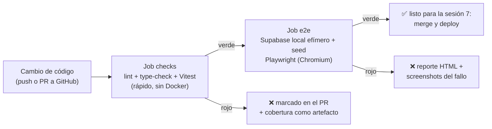

# MercadoTech — Sesión 6: Testing y CI con GitHub Actions

## Este documento contiene la especificación completa de la sesión. Léelo completamente antes de generar cualquier código. No hagas suposiciones fuera de lo especificado.

**Prompts de la sesión (ejecutar en orden; versión completa y autocontenida de cada uno en `PROMPTS_sesion6.md`):**

0. "Ejecuta el Prompt 0 de `PROMPTS_sesion6.md`: verifica la sesión 5, conecta el repo a GitHub e instala Vitest y Playwright."
1. "Lee `mercadotech/MercadoTech_sesion6.md` completo y confírmame que entiendes el alcance. No generes código todavía."
2. "Ejecuta la Fase 6.1: infraestructura de Vitest."
3. "Ejecuta la Fase 6.2: tests de lógica pura (validadores, utils, context builder y prompts)."
4. "Ejecuta la Fase 6.3: tests de services con Supabase mockeado."
5. "Ejecuta la Fase 6.4: infraestructura de Playwright con Page Objects y data-testid."
6. "Ejecuta la Fase 6.5: E2E del flujo comprador."
7. "Ejecuta la Fase 6.6: E2E del flujo vendedor."
8. "Ejecuta la Fase 6.7: pipeline de CI en GitHub Actions."
9. "Ejecuta la Fase 6.8: metodología de debugging y actualización de los gates."
10. "Ejecuta el Prompt de cierre de `PROMPTS_sesion6.md`: bitácora de la sesión en `docs/BITACORA.md` y actualización de `CLAUDE.md`."

---

## Objetivo general

Cubrir MercadoTech con una red de seguridad y ponerle portero: tests unitarios
(Vitest) para la lógica pura y de negocio, tests E2E (Playwright) para los dos
flujos críticos, y un pipeline de CI en GitHub Actions que corre TODO en cada
push y pull request. Aquí es donde la **inyección del cliente Supabase**
decidida en la sesión 2 paga: los services se testean sin red.

> **Cambio de alcance respecto al plan maestro (decidido por el docente,
> 2026-08-28):** esta sesión ABSORBE el pipeline de CI (antes Fase 7.1). La
> sesión 7 conserva performance, secretos, despliegue en Vercel y
> documentación final.

## Objetivos específicos

* Crear tests unitarios con Vitest y E2E con Playwright.
* Usar comandos internos de Claude Code para depuración (logs, reproducción, hipótesis).
* Configurar GitHub Actions para que ningún cambio entre sin pruebas verdes.
* Interpretar logs y errores del pipeline.
* Automatizar ciclos de revisión (integrar los tests al validator de la sesión 5).

---

## Qué vas a construir, en palabras simples

La tienda ya funciona — pero hoy nadie te avisa si un cambio la rompe. Esta
sesión instala tres niveles de protección, con una analogía de circo:

1. **Probar cada nudo de la red en el taller (tests unitarios, Vitest).**
   Cada función de lógica — validadores, formateo, el constructor de contexto,
   los services — se prueba sola, en milisegundos, SIN internet y SIN base de
   datos. ¿Cómo se prueba un service sin base de datos? Con un **mock**: un
   doble de utilería del cliente Supabase que responde lo que el test le
   indique. Esto es posible porque desde la sesión 2 todos los services
   aceptan el cliente inyectado.
2. **Un acróbata de prueba hace la rutina completa (tests E2E, Playwright).**
   Playwright abre un navegador de verdad, inicia sesión como `buyer1`, filtra
   el catálogo, compra, y verifica que todo pasó — contra la app real y el
   Supabase LOCAL con el seed. Si el kanban del vendedor deja de arrastrar,
   este nivel lo detecta; el unitario no puede.
3. **El portero automático (CI, GitHub Actions).** Cada vez que alguien sube
   código a GitHub, un robot en la nube instala el proyecto desde cero, corre
   lint + type-check + toda la suite unitaria, levanta un Supabase efímero y
   corre los E2E. Si algo falla, el push queda marcado en rojo con el reporte
   del fallo. Nadie más tiene que acordarse de correr los tests: el portero
   nunca falta.

### Glosario mínimo

| Término | En una línea |
|---|---|
| Test unitario | Prueba una función aislada con entradas controladas. Milisegundos, sin red. |
| Mock | Doble de utilería de una dependencia (aquí: el cliente Supabase) que responde lo que el test decide. |
| Inyección | Pasar la dependencia como parámetro en vez de crearla adentro — es lo que permite mockear sin trucos. |
| Cobertura | Porcentaje del código que los tests ejecutan. Meta: no un número global, sino 100 % en validadores y ≥ 80 % en services. |
| E2E (end-to-end) | Prueba que recorre la app como un usuario real, en un navegador real. |
| Page Object | Clase que encapsula una pantalla para los E2E ("LoginPage.login(user)") — si la UI cambia, se corrige en UN lugar. |
| `data-testid` | Atributo HTML para que los tests encuentren un elemento sin depender de textos o estilos. |
| Fixture | Preparación reutilizable de un test (ej. "navegador ya logueado como buyer1"). |
| CI | Integración continua: correr las verificaciones automáticamente en cada cambio. |
| Workflow / job / runner | La receta de CI (`.yml`) / cada bloque de trabajo / la máquina de GitHub que lo ejecuta. |
| Artefacto | Archivo que el CI guarda para descargar después (reporte de cobertura, screenshots del fallo). |
| Stack efímero | El Supabase que el runner levanta, siembra, usa y destruye en el mismo job — sin secretos, sin tocar nada remoto. |

---

## Antes de empezar: el repositorio en GitHub (tarea humana, no de Claude)

El repo es hoy solo local (`git remote -v` está vacío). El CI vive en GitHub,
así que sin esto la Fase 6.7 no se puede probar. Una vez, ~5 minutos, gratis:

1. Entra a https://github.com/new con tu cuenta (o créala en github.com/signup).
2. Nombre: `mercadotech` · visibilidad **Private** (es material de curso) ·
   NO marques "Add a README" ni .gitignore ni licencia (el repo ya existe local).
3. Copia la URL HTTPS que te da (`https://github.com/<tu-usuario>/mercadotech.git`).
4. El Prompt 0 conecta el remoto y hace el primer push; Windows te abrirá el
   navegador para autorizar (Git Credential Manager) la primera vez.

No hace falta ningún token ni secreto adicional: el CI de esta sesión corre
sin secretos (el stack efímero usa las claves estándar de cualquier Supabase
local, que no protegen nada).

---

## Estado de partida (validar con el Prompt 0 antes de empezar)

| Verificado (2026-08-28) | Detalle | Lo usa la fase |
|---|---|---|
| Sesiones 2–5 ejecutadas y cerradas | último commit `eed65ff` (cierre S5); bitácora al día; 4 Skills activas; servidor MCP en `mcp/` | todas |
| Services con cliente inyectable (15 archivos) | firma `fn(args, supabase = createClient())` — la base del mockeo | 6.3 |
| `lib/validators/{auth,product}.ts` | `validateLogin`, `validateRegister`, `isUserRole`, `validateProduct` (+ constantes de límites) | 6.2 |
| `lib/utils.ts` exporta SOLO `cn` y `formatPrice` | no existe formateo de fechas (la spec anterior lo suponía) | 6.2 |
| `lib/ai/context-builder.ts` puro (sin I/O) | diseñado en la sesión 4 exactamente para testearse aquí | 6.2 |
| Regla del kanban en `hooks/useSellerOrders.ts` | helper de transición a nivel de módulo (no exportado aún); `seller.service.updateOrderStatus` NO valida secuencia | 6.3 |
| `cart.service.addItem` suma y recorta a `[1, stock]` | no "rechaza" cantidad ≤ 0: la recorta (comportamiento real a testear) | 6.3 |
| CERO `data-testid` en `components/` y `app/` | grep = 0; hay que agregarlos | 6.4 |
| Usuarios del seed funcionales | `buyer1@mercadotech.test` / `seller1@mercadotech.test`, contraseña `MercadoTech123!` | 6.4–6.6 |
| Sin remoto de GitHub, sin `gh`, sin `.github/`, sin `packageManager` en `package.json` | tarea humana + Prompt 0 + Fase 6.7 | 0, 6.7 |
| npm local 11.6.2 (Windows) generó el lockfile | el pin de CI debe coincidir (lección ReadHub) | 6.7 |
| `mcp/` con `type-check` propio | el job de CI lo incluye | 6.7 |
| Sesión 1 no ejecutada | modelo sugerido por fase vive en `PROMPTS_sesion6.md` | — |

### Decisiones tomadas al validar contra el repo

| # | Hallazgo | Resolución | Fase |
|---|---|---|---|
| 1 | El CI estaba en la sesión 7 (Fase 7.1) y el docente pidió absorberlo aquí | Fase 6.7 = CI completo; `MercadoTech_sesion7.md` queda ajustada (pierde 7.1, conserva performance/secretos/deploy/docs) | 6.7 |
| 2 | No hay remoto de GitHub ni `gh` CLI | Tarea humana (crear repo) + Prompt 0 (conectar remoto y push). Sin esto, 6.7 no es verificable | 0 |
| 3 | La spec anterior pedía testear "formateo de fechas" que no existe | Se testea SOLO lo que existe: `cn` y `formatPrice` | 6.2 |
| 4 | La spec anterior ponía la regla del kanban en `seller.service.updateOrderStatus`, contradiciendo el diseño real (CLAUDE.md: la secuencia vive en el HOOK) | Refactor mecánico permitido: EXPORTAR el helper de transición ya existente en `useSellerOrders.ts` (sin cambiar lógica) y testearlo directo, sin React | 6.3 |
| 5 | La spec anterior decía "quantity ≤ 0 rechazado" en `addItem`; el código real SUMA y recorta a `[1, stock]` | Los tests anclan al comportamiento real (duplicado suma; tope = stock; piso = 1). Un test no inventa el contrato: lo documenta | 6.3 |
| 6 | Testing Library + jsdom estaban listados pero ninguna fase testea componentes | Se instala solo lo que se usa: `vitest` + `@vitest/coverage-v8`, environment `node`. Testear componentes queda fuera de alcance (escrito en Restricciones) | 6.1 |
| 7 | `chat.service` y `embedding.service` importan `lib/ai/*` directamente (no inyectable, por diseño de la sesión 4) | Regla de mockeo de dos niveles: Supabase SIEMPRE inyectado (jamás `vi.mock` del cliente); `lib/ai/*` se mockea con `vi.mock` de módulo — es la única excepción y se documenta en el test | 6.3 |
| 8 | Los E2E dependen de la IA solo en apariencia | Ningún E2E afirma respuestas de IA: sin token en CI, el error controlado inline es comportamiento VÁLIDO (criterio de la sesión 4). Los flujos comprador/vendedor no tocan el chat | 6.5, 6.6 |
| 9 | El drag con mouse de dnd-kit es frágil bajo Playwright | El E2E del kanban usa el camino de TECLADO de dnd-kit (KeyboardSensor ya activo desde la sesión 3): focus en el asa → Space → flecha → Space | 6.6 |
| 10 | Lección ReadHub (les pasó): lockfile generado en Windows + npm más nuevo en Linux = `Missing from lock file` por dependencias opcionales | `package.json` gana `"packageManager": "npm@11.6.2"` (la versión local que generó el lockfile) y el workflow instala EXACTAMENTE esa versión antes de `npm ci` | 6.7 |
| 11 | En CI no existe `.env.local` | El job E2E lee las credenciales del stack efímero con `supabase status -o json` y las pasa como env vars — NO son secretos (son las claves estándar de todo Supabase local) | 6.7 |
| 12 | Localmente `next dev` ya corre; en CI no hay nada | `playwright.config.ts` con `webServer`: en CI `npm run build && npm run start` (paridad con producción); en local reutiliza el dev server si ya está arriba (patrón ReadHub) | 6.4 |
| 13 | La Skill `mercadotech-automatic-validator` existe y no conoce los tests | La Fase 6.8 la actualiza: el gate incluye `npm run test` (y E2E si el stack local está arriba) | 6.8 |

---

## Mapa de fases y dependencias

| Fase | Qué entrega (en una línea) | Depende de | Se verifica con |
|---|---|---|---|
| 6.1 | Vitest configurado (alias `@/`, coverage, scripts) | Prompt 0 | `npm run test` corre en verde (0 tests) y genera reporte de cobertura |
| 6.2 | Suite de lógica pura: validadores 100 %, utils, context-builder, prompts | 6.1 | `npm run test` verde; cobertura 100 % ramas en `lib/validators/` y `context-builder` |
| 6.3 | Suite de services con mock encadenable inyectado (≥ 80 % líneas) | 6.2 | `npm run test` verde SIN red (se puede correr con Supabase apagado) |
| 6.4 | Playwright + Page Objects + `data-testid` en los componentes | Prompt 0 | `npx playwright test --list` enumera specs; la app sigue igual (solo atributos) |
| 6.5 | E2E flujo comprador + tests negativos | 6.4 | `npm run test:e2e` verde contra Supabase local con seed |
| 6.6 | E2E flujo vendedor (publicar + kanban por teclado) | 6.5 | ídem; la tarjeta movida persiste tras recargar |
| 6.7 | `.github/workflows/ci.yml` con jobs `checks` y `e2e` verdes en GitHub | 6.3, 6.6, remoto | un push y un PR de prueba muestran ambos jobs en verde en la pestaña Actions |
| 6.8 | `docs/DEBUGGING.md` + validator con tests + norma en `CLAUDE.md` | 6.7 | el validator FALLA si se rompe un test a propósito (y se revierte) |

## Convenciones transversales

* **Los tests unitarios JAMÁS tocan la red**: ni Supabase ni Hugging Face. Si
  un test necesita el stack local para pasar, está mal escrito.
* **Mockeo de dos niveles (decisión 7):** el cliente Supabase se INYECTA
  (mock encadenable construido en el test); `lib/ai/*` se mockea con
  `vi.mock` de módulo. Nunca `vi.mock` de `lib/supabase/*`.
* **El test documenta el contrato real**, no el deseado (decisión 5). Si un
  comportamiento real parece un bug, se anota en la bitácora y se decide
  aparte — no se "corrige" callado para que el test luzca mejor.
* **Convención de ubicación:** el test unitario vive JUNTO al archivo
  (`cart.service.test.ts` al lado de `cart.service.ts`); los E2E viven en
  `e2e/`.
* Los E2E corren contra **Supabase local** (`supabase start` + `db reset`) —
  el remoto NUNCA se usa en tests.
* Selectores E2E solo por `data-testid` o rol accesible — nunca por clases
  CSS ni textos largos.
* `mcp/` no se testea en esta sesión (solo su `type-check` entra al CI).

---

# FASES

## Fase 6.1 — Infraestructura de Vitest

**Prompt sugerido:** "Ejecuta la Fase 6.1 de `MercadoTech_sesion6.md`."

### Qué se construye

El taller de pruebas: Vitest configurado para que cualquier archivo del
proyecto pueda tener su test al lado, con cobertura medible. Sin tests aún.

### Depende de

Prompt 0 (dependencias instaladas: `vitest`, `@vitest/coverage-v8`).

### Archivos

| Archivo | Rol |
|---|---|
| `vitest.config.ts` | environment `node`; alias `@/` → raíz (mismo que tsconfig); include `**/*.test.ts`; exclude `node_modules`, `mcp/`, `e2e/`, `.next/`; coverage v8 con reporte `text` + `html` limitado a `lib/` y `services/`. |
| `package.json` | Scripts: `test` (`vitest run`), `test:watch` (`vitest`), `test:coverage` (`vitest run --coverage`). |

### Reglas

* Environment `node` (decisión 6): no hay tests de componentes en esta sesión,
  así que jsdom y Testing Library NO se instalan.
* El alias debe resolver igual que en la app: un test importa
  `@/services/cart.service`, no rutas relativas largas.
* No escribir ningún test todavía (eso es 6.2) — solo probar que el taller abre.

### Cómo verificar al terminar

1. `npm run test -- --passWithNoTests` → verde, "no tests found".
2. `npm run test:coverage -- --passWithNoTests` → genera `coverage/` con el
   reporte HTML.
3. `npm run lint` y `npm run type-check` siguen pasando.

## Fase 6.2 — Tests de lógica pura

**Prompt sugerido:** "Ejecuta la Fase 6.2 de `MercadoTech_sesion6.md`."

### Qué se construye

Los tests de todo lo que no tiene dependencias: validadores, utilidades y la
capa pura de IA. Son los tests más baratos y los que más ramas cubren.

### Depende de

6.1.

### Archivos

| Archivo | Casos mínimos |
|---|---|
| `lib/validators/auth.test.ts` | email inválido, password < 8, display_name fuera de 2–60, rol `admin` rechazado (`REGISTRABLE_ROLES`), caso feliz por rol. |
| `lib/validators/product.test.ts` | título < 5 y > 120, precio 0/negativo/válido, stock negativo, sin categoría, sin imágenes → error por CAMPO correcto; caso feliz completo. |
| `lib/utils.test.ts` | `formatPrice`: 0, redondeo a 2 decimales, separador de miles, entrada `string` ("219.00") y `number`; `cn`: merge básico de clases (decisión 3: fechas NO — no existe). |
| `lib/ai/context-builder.test.ts` | filtra por similitud mínima y por longitud mínima; respeta `maxSources` y el presupuesto de caracteres; descarta la última fuente si lo que resta del presupuesto < mínimo truncado; `contextTruncated` refleja la realidad; orden estable por similitud descendente; lista vacía y todo-bajo-el-umbral. |
| `lib/ai/prompts.test.ts` | `buildRagUserMessage` contiene la query y las fuentes numeradas; `SUPPORT_SYSTEM_INSTRUCTIONS` incluye la instrucción de sugerir ticket. |

### Reglas

* Objetivo: **100 % de ramas** en `lib/validators/` y `context-builder` (son
  pura lógica; no hay excusa).
* Cero mocks en esta fase: si un test de aquí necesita mockear algo, el
  archivo bajo prueba no es puro y hay que reportarlo, no forzarlo.
* Los valores límite salen de las constantes reales
  (`PASSWORD_MIN_LENGTH`, `TITLE_MIN`…), no de números copiados.

### Cómo verificar al terminar

1. `npm run test` → verde.
2. `npm run test:coverage` → `lib/validators/` y `lib/ai/context-builder.ts`
   al 100 % de ramas (pegar la tabla del reporte).

## Fase 6.3 — Tests de services con Supabase mockeado

**Prompt sugerido:** "Ejecuta la Fase 6.3 de `MercadoTech_sesion6.md`."

### Qué se construye

La suite de la lógica de negocio: cada service probado con un doble del
cliente Supabase construido en el test e inyectado por el último parámetro —
la arquitectura de la sesión 2 cobrando su dividendo.

### Depende de

6.2. Requiere un refactor mecánico previo (decisión 4): exportar el helper de
transición de `hooks/useSellerOrders.ts` (ya existe a nivel de módulo; solo se
le agrega `export`, cero cambios de lógica).

### Archivos

| Archivo | Casos mínimos (anclados al comportamiento REAL) |
|---|---|
| `services/test-utils/supabase-mock.ts` | Fábrica del mock encadenable (`from().select().eq().maybeSingle()` …) con respuestas programables por tabla. Único helper compartido de la fase. |
| `services/cart.service.test.ts` | `addItem`: producto nuevo inserta; duplicado SUMA cantidades; resultado recortado al stock; piso 1 (decisión 5); errores de lectura propagados tal cual. |
| `services/order.service.test.ts` | `checkout` llama al RPC con `p_buyer_id` y propaga el MENSAJE del error ("Stock insuficiente para…"); `cancelIfPending` filtra por `status = 'pendiente'`. |
| `services/product.service.test.ts` | filtros construyen la query (categoría/condición/precio/búsqueda/rango de página); `price` string → number; `image_url` = portada por menor `position`. |
| `services/seller.service.test.ts` | `listMyProducts` incluye inactivos; `updateOrderStatus` envía el status destino (la secuencia NO está aquí — ver siguiente fila). |
| `hooks/useSellerOrders.test.ts` | El helper de transición EXPORTADO: los 3 pasos válidos del flujo; saltos rechazados; `cancelado` no se reactiva ni es destino del vendedor; estado desconocido rechazado (decisión 4 — sin React, sin renderHook). |
| `services/review.service.test.ts` | `canReview` false sin pedido entregado; false con reseña existente; true con `{allowed, orderId}` correcto. |
| `services/question.service.test.ts`, `favorite.service.test.ts`, `auth.service.test.ts` | caso feliz + error propagado por función pública. |
| `services/embedding.service.test.ts` | con `vi.mock("@/lib/ai/embeddings")` (decisión 7): construye el texto y hace upsert; el error del proveedor se propaga. |
| `services/vector-search.service.test.ts` | mock de embeddings + RPC: resultados huérfanos (producto ya inexistente) se DESCARTAN al hidratar; threshold y topK pasados al RPC. |
| `services/chat.service.test.ts` | con `vi.mock` de `lib/ai/*`: orquesta en el ORDEN búsqueda → contexto → completion (spies); `hasRelevantContext = false` cuando el builder no selecciona fuentes — y la completion SE LLAMA igual (comportamiento de la sesión 4). |

### Reglas

* El cliente Supabase se INYECTA siempre; `vi.mock` solo para `lib/ai/*`
  (decisión 7, documentada en comentario en cada test que la use).
* Ningún test abre red: la suite completa debe pasar con Docker apagado.
* Si un test revela un bug real: NO se cambia la lógica en esta fase — se
  documenta el hallazgo (bitácora) y el test se ancla al comportamiento
  actual con un comentario `// comportamiento actual, revisar:`.
* Objetivo de cobertura: `services/` ≥ 80 % de líneas.

### Cómo verificar al terminar

1. Detener Docker/Supabase → `npm run test` sigue verde (prueba de cero red).
2. `npm run test:coverage` → `services/` ≥ 80 % líneas (pegar la tabla).
3. `npm run lint` y `npm run type-check` pasan (el refactor del hook no rompió nada).

## Fase 6.4 — Infraestructura de Playwright

**Prompt sugerido:** "Ejecuta la Fase 6.4 de `MercadoTech_sesion6.md`."

### Qué se construye

El circo montado para el acróbata: Playwright configurado con el patrón
probado en ReadHub, los Page Objects de las pantallas críticas, y los
`data-testid` que hoy no existen (grep = 0, decisión de partida).

### Depende de

Prompt 0 (`@playwright/test` + navegadores instalados). Stack local corriendo.

### Archivos

| Archivo | Rol |
|---|---|
| `playwright.config.ts` | `testDir: "./e2e"`; `baseURL` desde `PLAYWRIGHT_BASE_URL` (default `http://localhost:3000`); `forbidOnly` en CI; retries 2 en CI / 0 local; workers 1 en CI; reporter `github` + `html` en CI, `html` + `list` local; screenshots/video/trace solo en fallo; proyectos chromium/firefox/webkit; `webServer`: en CI `npm run build && npm run start`, local reutiliza `npm run dev` (decisión 12). |
| `e2e/data/users.ts` | Usuarios DEL SEED: buyer1 y seller1 con `MercadoTech123!` (documentar que vienen de `supabase/seed.sql`). |
| `e2e/data/product-image.jpg` | Imagen pequeña de fixture para el test de publicar (6.6). |
| `e2e/fixtures/test.ts` | Fixture `test` extendido con login por Page Object (sesión por test — sin estado compartido entre specs). |
| `e2e/pages/LoginPage.ts`, `CatalogPage.ts`, `ProductPage.ts`, `CartPage.ts`, `OrdersPage.ts`, `SellerProductsPage.ts`, `SellerKanbanPage.ts` | Un Page Object por pantalla: localizadores por `data-testid` + acciones con nombre de negocio (`addToCart(qty)`, `moveOrderForward(orderId)`). |
| Componentes existentes (varios) | AGREGAR `data-testid` donde los Page Objects los necesiten. Cambio permitido: SOLO el atributo — ni lógica, ni estilos, ni estructura. |
| `package.json` | Scripts: `test:e2e` (`playwright test`), `test:e2e:ui` (`playwright test --ui`). |

### Reglas

* Requisito de entorno DOCUMENTADO en el config: los E2E corren contra
  Supabase local (`supabase start && supabase db reset`) — nunca remoto.
* Nombres de `data-testid` en kebab-case y con prefijo de dominio
  (`cart-item-quantity`, `kanban-column-pagado`).
* Ningún spec todavía (eso es 6.5–6.6); un smoke spec mínimo
  (`home.spec.ts`: la home carga y muestra el grid) para probar la tubería.

### Cómo verificar al terminar

1. `supabase status` verde → `npm run test:e2e -- home.spec.ts` pasa en los
   3 navegadores locales.
2. `npx playwright test --list` enumera el smoke.
3. `npm run build` sigue pasando (los `data-testid` no rompieron nada).

## Fase 6.5 — E2E: flujo comprador

**Prompt sugerido:** "Ejecuta la Fase 6.5 de `MercadoTech_sesion6.md`."

### Qué se construye

La rutina completa del comprador, en un spec con `test.step` por paso, más los
negativos que protegen el checkout.

### Depende de

6.4. Estado de datos: correr `supabase db reset` antes de la suite (los tests
crean pedidos reales; las aserciones se hacen sobre el pedido RECIÉN creado,
identificado por la URL de redirección — nunca "el primero de la lista").

### Archivos

| Archivo | Contenido |
|---|---|
| `e2e/tests/buyer-flow.spec.ts` | (1) login buyer1 → catálogo con su menú de usuario; (2) filtra "Laptops" → el grid solo muestra laptops; (3) abre un producto CON stock → galería, precio; (4) agrega 2 unidades → contador del navbar = 2; (5) carrito → subtotal correcto → "Finalizar compra"; (6) redirige a `/pedidos/[id]` → estado `pendiente`, ítems snapshot; (7) "Mis pedidos" lista ese pedido (por id); (8) logout → navbar anónimo. |
| `e2e/tests/buyer-negative.spec.ts` | Producto con stock 0 (`b…06` del seed) → botón deshabilitado con motivo visible; `/carrito` vacío → botón de checkout deshabilitado o `EmptyState` (según la UI real); anónimo en `/carrito` → redirect a `/login?redirectTo=/carrito`. |

### Reglas

* Ninguna aserción sobre respuestas de IA (decisión 8) — el flujo no visita
  `/asistente` ni la pestaña IA.
* Aserciones de dinero contra `formatPrice` real (S/ y formato) — no números
  mágicos re-formateados a mano.
* Cada paso con `test.step` para que el reporte del CI se lea como la lista
  de arriba.

### Cómo verificar al terminar

1. `supabase db reset` → `npm run test:e2e -- buyer` verde (chromium al menos).
2. Forzar un fallo (cambiar una aserción) → el reporte HTML muestra screenshot
   del paso fallido; revertir.

## Fase 6.6 — E2E: flujo vendedor

**Prompt sugerido:** "Ejecuta la Fase 6.6 de `MercadoTech_sesion6.md`."

### Qué se construye

La rutina del vendedor: publicar con imagen y mover un pedido por el kanban —
la interacción más frágil del proyecto, cubierta por el camino accesible.

### Depende de

6.5 (fixtures y pages ya probados).

### Archivos

| Archivo | Contenido |
|---|---|
| `e2e/tests/seller-flow.spec.ts` | (1) login seller1 → panel; (2) publica un producto (título único por timestamp) con `e2e/data/product-image.jpg`; (3) aparece en su tabla Y en el catálogo público; (4) kanban: mueve el pedido `pagado` del seed a `enviado` POR TECLADO (decisión 9: focus en el asa → Space → ArrowRight → Space, el patrón de KeyboardSensor); la tarjeta queda en la columna nueva y PERSISTE tras `page.reload()`; (5) login como el comprador de ese pedido → su detalle muestra `enviado`. |
| `e2e/tests/seller-negative.spec.ts` | buyer1 entra a `/vendedor/productos` → toast/redirect fuera del panel; intento de mover un pedido `enviado` de vuelta a `pagado` → la UI lo rechaza (toast) y la tarjeta no cambia. |

### Reglas

* El drag se hace por teclado, no con `mouse.down/move/up` (decisión 9). Si el
  camino de teclado no funciona, eso ES un hallazgo de accesibilidad — se
  reporta, no se maquilla con mouse.
* El producto publicado por el test queda en la BD local — aceptable: el
  título con timestamp evita colisiones y `db reset` limpia.

### Cómo verificar al terminar

1. `supabase db reset` → `npm run test:e2e` COMPLETO verde (comprador + vendedor).
2. En el reporte HTML, el paso del kanban muestra la tarjeta en la columna
   `enviado`.

## Fase 6.7 — Pipeline de CI en GitHub Actions

**Prompt sugerido:** "Ejecuta la Fase 6.7 de `MercadoTech_sesion6.md`."

### Qué se construye

El portero: `.github/workflows/ci.yml` con dos jobs encadenados que corren
todo lo anterior en cada push y PR, sin ningún secreto. Patrón probado en
ReadHub, con sus lecciones ya incorporadas.

### Depende de

6.3 y 6.6 verdes en local; remoto de GitHub conectado (Prompt 0).

### Archivos

| Archivo | Rol |
|---|---|
| `package.json` | AGREGAR `"packageManager": "npm@11.6.2"` — la versión local que generó el lockfile (decisión 10). |
| `.github/workflows/ci.yml` | El workflow completo (abajo). |

**Job `checks`** (rápido, sin Docker, timeout 15 min):
1. Checkout + `actions/setup-node@v4` (Node 24, caché npm).
2. **Pinnear npm**: `npm install -g npm@11.6.2` (debe coincidir con
   `packageManager`; decisión 10 — la lección exacta de ReadHub:
   "Missing from lock file" por opcionales de Linux resueltas distinto).
3. `npm ci` → `npm run type-check` → `npm run lint` → `npm run test:coverage`.
4. Type-check del MCP: `npm ci` + `npm run type-check` dentro de `mcp/`.
5. Subir `coverage/` como artefacto (retención 7 días, `if: always()`).

**Job `e2e`** (needs: checks, timeout 20 min):
1. Checkout + Node + pin de npm + `npm ci`.
2. Chromium de Playwright con caché por lockfile
   (`~/.cache/ms-playwright`); `npx playwright install --with-deps chromium`
   (solo chromium en CI; los 3 navegadores quedan para local).
3. `supabase/setup-cli@v1` → `supabase start` → `supabase db reset`
   (migraciones + seed; Docker ya viene en `ubuntu-latest`).
4. Leer credenciales con `supabase status -o json` + `jq` → env vars del paso
   de tests (decisión 11 — NO son secretos).
5. `npx playwright test --project=chromium` con esas vars +
   `NEXT_PUBLIC_SITE_URL=http://localhost:3000` (el webServer del config hace
   `build && start`, decisión 12).
6. Subir reporte HTML + screenshots SOLO `if: failure()` (retención 14 días).
7. `supabase stop` en `if: always()`.

Extras: triggers `pull_request` + `push` a main + `workflow_dispatch`;
`concurrency` con `cancel-in-progress: true`; `permissions: contents: read`.

### Reglas

* CERO secretos en el workflow: sin `HUGGINGFACEHUB_API_TOKEN` (los E2E no lo
  necesitan — decisión 8; probar RAG real en CI sería un workflow manual
  aparte, fuera de alcance).
* La protección de rama (checks obligatorios para merge) es de la sesión 7 —
  aquí solo se construye y se ve verde.

### Cómo verificar al terminar

1. Commit + push → pestaña **Actions** del repo: `checks` y `e2e` en verde.
2. Abrir un PR de prueba (rama `ci-smoke` con un cambio trivial) → el PR
   muestra los dos checks; romper un test a propósito en esa rama → el PR
   queda en rojo con el reporte; cerrar el PR sin merge y revertir.
3. Descargar el artefacto de cobertura desde la corrida verde.

## Fase 6.8 — Debugging y actualización de los gates

**Prompt sugerido:** "Ejecuta la Fase 6.8 de `MercadoTech_sesion6.md`."

### Qué se construye

La metodología escrita de depuración y el cierre del círculo con la sesión 5:
el validator ahora exige los tests, y la norma queda en `CLAUDE.md`.

### Depende de

6.7 (el CI existe: la metodología incluye leer sus fallos).

### Archivos

| Archivo | Contenido |
|---|---|
| `docs/DEBUGGING.md` | (1) Flujo: síntoma → reproducir (un test que falla es la mejor reproducción) → leer logs (servidor Next, endpoint de chat, `supabase logs`, y el reporte de CI: qué job, qué artefacto descargar) → hipótesis única → fix → el test pasa. (2) Cómo pedirle debugging a Claude (qué contexto darle: síntoma, pasos, log literal, qué se descartó). (3) Errores típicos del stack y su lectura: RLS deniega (0 filas o 401 según ruta), GRANT faltante (`permission denied`), modelo HF sin proveedor (falla el request, no la config), dimensión de vector errada, `Missing from lock file` en CI (pin de npm), stdout corrupto en MCP. |
| `.claude/skills/mercadotech-automatic-validator/SKILL.md` | ACTUALIZAR: el gate incluye `npm run test` (obligatorio) y los E2E si el stack local está arriba (`supabase status` verde); en rojo = FALLIDA, como todo lo demás. |
| `CLAUDE.md` | Norma nueva: al terminar cualquier feature, el ciclo es reviewer → correcciones → validator (que ya corre los tests). El Prompt de cierre lo integrará con el resto de cambios. |

### Reglas

* `docs/DEBUGGING.md` se escribe para un alumno: cada error típico con el
  mensaje LITERAL que se ve y el primer paso concreto.
* La actualización de la Skill es quirúrgica: solo el ítem nuevo del
  checklist, sin reescribir el resto.

### Cómo verificar al terminar

1. Romper un test a propósito → invocar el validator → **VALIDACIÓN FALLIDA**
   citando el test; revertir → APROBADA.
2. `docs/DEBUGGING.md` permite a alguien que no estuvo diagnosticar el error
   de lockfile de CI solo leyendo la tabla.

---

## Si algo falla: síntomas y diagnóstico

| Síntoma | Causa más probable | Qué hacer |
|---|---|---|
| Vitest no resuelve `@/services/…` | Falta el alias en `vitest.config.ts` | Mapear `@` a la raíz igual que el tsconfig |
| Un test unitario pasa solo con Supabase arriba | El mock no cubre esa llamada y el default `createClient()` se coló | Inyectar el mock en TODAS las llamadas; correr la suite con Docker apagado para cazarlos |
| `addItem` "debería rechazar 0" según un test viejo | El contrato real recorta a `[1, stock]` (decisión 5) | El test se ancla al código real; si parece bug, va a bitácora |
| Playwright: timeout esperando el webServer | `next build` lento o puerto ocupado | Subir `webServer.timeout`; verificar que no haya otro dev server en 3000 |
| E2E rojos con "0 rows" o login fallido | Falta `supabase db reset` (datos sucios de corridas previas) | Resetear antes de la suite; es parte del contrato de E2E |
| El drag del kanban no ocurre en Playwright | Se intentó con mouse (decisión 9) | Camino de teclado: focus asa → Space → flecha → Space |
| CI: `npm ci` falla con `Missing … from lock file` | npm del runner más nuevo que el del lockfile (decisión 10) | Pin exacto: `npm install -g npm@11.6.2` antes de `npm ci` |
| CI: job e2e no encuentra la app | Faltan las env vars dinámicas del paso `supabase status` | Revisar el paso de credenciales y que el webServer haga `build && start` |
| CI verde local, rojo en Actions solo en E2E | Diferencia dev vs build de producción | Correr local `npm run build && npm run start` y la suite contra eso |
| El validator no menciona los tests | Skill sin actualizar o sesión de Claude sin reiniciar | Fase 6.8 + reiniciar sesión |

---

## Restricciones de la sesión

* Los tests unitarios NO llaman a la red (ni Supabase ni Hugging Face) — todo
  mockeado/inyectado.
* Los E2E NO corren contra el Supabase remoto, y NINGUNO afirma respuestas de IA.
* No cambiar lógica de producción para "hacer pasar" un test sin entender la
  causa; el único refactor permitido es exportar el helper del kanban
  (decisión 4) y agregar `data-testid`.
* No perseguir 100 % de cobertura global — objetivos: validadores y
  context-builder 100 % ramas, `services/` ≥ 80 % líneas, flujos E2E críticos.
* No testear componentes React (fuera de alcance, decisión 6) ni el servidor
  MCP (solo su type-check en CI).
* Sin secretos en el workflow; sin protección de rama ni deploy (sesión 7).

## Entregables

1. Infraestructura Vitest + Playwright configurada (scripts en `package.json`).
2. Suite unitaria: lógica pura + services con la cobertura objetivo.
3. 4 specs E2E (comprador, vendedor y sus negativos) + Page Objects + `data-testid`.
4. `.github/workflows/ci.yml` con jobs `checks` y `e2e` verdes en GitHub + `packageManager` en `package.json`.
5. `docs/DEBUGGING.md` + validator actualizado + norma en `CLAUDE.md`.
6. Bitácora y `CLAUDE.md` actualizados (Prompt de cierre).

## Criterios de aceptación de la sesión

* `npm run test` verde con Docker APAGADO, con la cobertura objetivo.
* `npm run test:e2e` verde contra Supabase local con el seed.
* El kanban drag & drop está cubierto por E2E vía teclado (la interacción más frágil del proyecto).
* Un push y un PR de prueba muestran ambos jobs de CI en verde en GitHub; un test roto los pone en rojo.
* La Skill validator ejecuta los tests como parte del gate (FALLIDA si hay un test rojo).
* `npm run lint`, `npm run type-check` y `npm run build` pasan.

---

## Registro de cambios de esta versión de la spec (2026-08-28)

Validación contra el repositorio (sesiones 2–5 ejecutadas y cerradas) y contra
el CI y la configuración de Playwright reales de ReadHub. Cambios:

* **Cambio de alcance decidido por el docente:** la sesión absorbe el pipeline
  de CI de GitHub Actions (antes Fase 7.1) como Fase 6.7; `MercadoTech_sesion7.md`
  queda ajustada. Es el ÚNICO cambio de alcance funcional.
* **Estructura:** mismo patrón de las sesiones 3–5 (skill
  `planificacion-por-fases`): Estado de partida, 13 decisiones de validación,
  mapa de fases, cinco secciones por fase, troubleshooting, registro de cambios.
  Las fases se renumeraron al fusionar los tests de lógica pura (antes 6.2 y
  6.4) en una sola fase.
* **Capa didáctica nueva:** analogía red/acróbata/portero, glosario, diagrama
  del pipeline, tarea humana del repo de GitHub, verificaciones en lenguaje de
  acciones.
* **Anclas al código real:** fechas inexistentes fuera; regla del kanban
  testeada donde vive (el hook, no el service); `addItem` testeado con su
  recorte real `[1, stock]`; mockeo de dos niveles (Supabase inyectado,
  `lib/ai` por módulo); `data-testid` desde cero (hoy hay 0).
* **Lecciones de ReadHub incorporadas con evidencia:** pin de npm contra el
  lockfile de Windows, credenciales dinámicas del stack efímero, chromium-only
  en CI, `build && start` para paridad, artefactos solo en fallo, cachés.
