# Arquitectura — MercadoTech

Documento de referencia para quien se une al proyecto sin haber estado en
las sesiones de construcción. Describe lo que **existe en el repo hoy**
(cierre de la sesión 2 de infraestructura, más el frontend de la sesión 3
ya construido encima). Si algo de este documento choca con el código,
**gana el código** — se señala como nota donde corresponda.

No duplica el SQL completo: para el DDL y las policies letra por letra,
ver [`supabase/schema.sql`](../supabase/schema.sql) y
[`supabase/policies.sql`](../supabase/policies.sql) (ambos son copias de
referencia; la fuente de verdad real son las migraciones en
[`supabase/migrations/`](../supabase/migrations/)).

## Tabla de contenidos

1. [Arquitectura general y capas](#arquitectura-general-y-capas)
2. [Organización de carpetas](#organización-de-carpetas)
3. [Modelo relacional](#modelo-relacional)
4. [Decisiones de diseño](#decisiones-de-diseño)
5. [Integración Next.js ↔ Supabase](#integración-nextjs--supabase)
6. [Flujo de autenticación](#flujo-de-autenticación)
7. [Estrategia de escalabilidad](#estrategia-de-escalabilidad)
8. [Políticas RLS](#políticas-rls)
9. [Qué sigue](#qué-sigue)

## Arquitectura general y capas

MercadoTech es un marketplace (Next.js 15 App Router + Supabase) con un
único camino de datos, de arriba hacia abajo:

```
components/  →  hooks/  →  services/  →  Supabase (Postgres + RLS)
```

- **`components/`** — presentación pura. No hacen fetching, no conocen
  Supabase. Reciben todo por props.
- **`hooks/`** — estado de cliente (`useState`/`useEffect`). Llaman
  únicamente a `services/`. Sin lógica de negocio propia, salvo la que la
  spec asigna explícitamente al hook (ej. validar la transición del
  kanban de pedidos antes de llamar al service — ver
  [Decisiones de diseño](#decisiones-de-diseño)).
- **`services/`** — lógica de negocio. Funciones `async` puras que reciben
  el cliente de Supabase **inyectado** (último parámetro, con default al
  cliente de navegador). No importan React. No hay una capa REST paralela:
  toda la app pasa por aquí, con RLS aplicando siempre.
- **`lib/supabase/`** — los 4 clientes: `client.ts` (navegador, RLS),
  `server.ts` (Server Components/Route Handlers, cookies, RLS),
  `middleware.ts` (refresco de sesión), `admin.ts` (service role — bypasea
  RLS, solo servidor, ver la advertencia dentro del archivo).
- **`app/api/v1/`** — Route Handlers, reservados para lo que no puede
  correr en el navegador (secretos de proveedor de IA/voz, service role).
  Vacío hasta la sesión 4: esta sesión no crea ninguno.

Esta capa se verifica automáticamente con dos búsquedas que deben devolver
vacío (ver [CLAUDE.md](../CLAUDE.md)):

```
grep -rl "@/lib/supabase" components hooks
grep -rl "from \"@/services" components
```

## Organización de carpetas

```
app/(auth)/        login, register — públicas
app/(shop)/         catálogo, producto, carrito, pedidos — la mayoría pública, acciones requieren sesión
app/(seller)/       panel del vendedor, bajo el prefijo /vendedor/
app/api/v1/          Route Handlers server-only (vacío hasta sesión 4)
components/ui/       primitivas de shadcn/ui (base-ui), sin lógica de dominio
components/shared/    EmptyState, ErrorState, LoadingState, Price, ProductImage, RatingStars, ConditionBadge, Container
components/layout/    Navbar, MobileNav, SearchBar, CategoriesMenu, CartIndicator, UserMenu, SellerSidebar, NavLink
components/{catalog,product,cart,orders,seller,auth}/  presentación de cada dominio
hooks/                un hook por dominio (useAuth, useCart, useProducts, useSellerOrders, ...)
services/             un service por dominio (mismo nombre que su tabla o dominio)
lib/supabase/         los 4 clientes
lib/constants/        tunables documentados (roles.ts, catalog.ts, product.ts, orders.ts, routes.ts)
lib/validators/       validación framework-agnóstica (auth.ts, product.ts)
lib/ai/, lib/voice/    vacíos — reservados para sesiones 4 y 8
types/                 database.ts (generado) + tipos de dominio por archivo
supabase/migrations/    fuente de verdad del esquema, RLS y Storage
supabase/schema.sql, policies.sql   copias de referencia (NO fuente de verdad)
supabase/tests/          validación RLS ejecutable (Fase 2.6)
docs/                     este archivo + SESION3_CHECKLIST.md + BITACORA.md
```

## Modelo relacional

14 tablas en `public`, todas con RLS habilitado. `auth.users` es la tabla
de identidad de Supabase Auth (fuera de `public`); `profiles` la extiende
1:1.

```mermaid
erDiagram
    PROFILES ||--o{ PRODUCTS : "seller_id"
    PROFILES ||--o{ CART_ITEMS : "user_id"
    PROFILES ||--o{ ORDERS : "buyer_id"
    PROFILES ||--o{ ORDER_ITEMS : "seller_id (denormalizado)"
    PROFILES ||--o{ QUESTIONS : "user_id"
    PROFILES ||--o{ REVIEWS : "buyer_id"
    PROFILES ||--o{ FAVORITES : "user_id"
    PROFILES ||--o{ PRODUCT_VIEWS : "user_id"
    PROFILES ||--o{ SUPPORT_TICKETS : "user_id"
    CATEGORIES ||--o{ CATEGORIES : "parent_id"
    CATEGORIES ||--o{ PRODUCTS : "category_id"
    PRODUCTS ||--o{ PRODUCT_IMAGES : "product_id"
    PRODUCTS ||--o{ CART_ITEMS : "product_id"
    PRODUCTS ||--o{ ORDER_ITEMS : "product_id (nullable)"
    PRODUCTS ||--o{ QUESTIONS : "product_id"
    PRODUCTS ||--o{ REVIEWS : "product_id"
    PRODUCTS ||--o{ FAVORITES : "product_id"
    PRODUCTS ||--o{ PRODUCT_VIEWS : "product_id"
    ORDERS ||--o{ ORDER_ITEMS : "order_id"
    ORDERS ||--o{ REVIEWS : "order_id"
    SUPPORT_TICKETS ||--o{ TICKET_MESSAGES : "ticket_id"

    PROFILES {
        uuid id PK "= auth.users.id"
        text role "buyer/seller/admin, default buyer"
        text display_name
    }
    CATEGORIES {
        uuid id PK
        text slug UK
        uuid parent_id FK "self, on delete set null"
    }
    PRODUCTS {
        uuid id PK
        uuid seller_id FK
        uuid category_id FK
        text condition "nuevo/usado/reacondicionado"
        numeric price
        int stock
        boolean is_active
    }
    PRODUCT_IMAGES {
        uuid id PK
        uuid product_id FK
        text image_path
        int position "orden, lo mueve el drag & drop"
    }
    CART_ITEMS {
        uuid id PK
        uuid user_id FK
        uuid product_id FK
        int quantity
    }
    ORDERS {
        uuid id PK
        uuid buyer_id FK
        text status "pendiente/pagado/enviado/entregado/cancelado"
        numeric total
    }
    ORDER_ITEMS {
        uuid id PK
        uuid order_id FK
        uuid product_id FK "nullable, on delete set null"
        uuid seller_id FK "denormalizado desde products"
        text title_snapshot
        numeric price_snapshot
        int quantity
    }
    QUESTIONS {
        uuid id PK
        uuid product_id FK
        uuid user_id FK
        text question
        text answer "null hasta que el vendedor responde"
    }
    REVIEWS {
        uuid id PK
        uuid product_id FK
        uuid buyer_id FK
        uuid order_id FK "prueba de compra verificada"
        int rating "1-5"
    }
    FAVORITES {
        uuid id PK
        uuid user_id FK
        uuid product_id FK
    }
    PRODUCT_VIEWS {
        uuid id PK
        uuid product_id FK
        uuid user_id FK
        timestamptz viewed_at "evento, append-only"
    }
    SUPPORT_ARTICLES {
        uuid id PK
        text title
        text category
        boolean is_published
    }
    SUPPORT_TICKETS {
        uuid id PK
        uuid user_id FK
        text status "abierto/en_proceso/resuelto/cerrado"
        text channel "chat/voz"
    }
    TICKET_MESSAGES {
        uuid id PK
        uuid ticket_id FK
        text sender_role "usuario/agente/humano"
    }
```



`support_articles` no tiene FK hacia otra tabla de dominio — es la base de
conocimiento del RAG de soporte (sesión 4), independiente del resto.

## Decisiones de diseño

**Snapshots en `order_items`** (`title_snapshot`, `price_snapshot`). Un
pedido es un registro histórico: si el vendedor edita el precio o el
título del producto después, el pedido ya facturado no debe cambiar.
`product_id` es *nullable* con `on delete set null` por el mismo motivo —
si el producto se borra, el historial sobrevive sin el enlace de
navegación.

**Checkout como función transaccional** (`create_order_from_cart`,
`supabase/migrations/20260821101700_create_checkout_function.sql`). Una
función `plpgsql` es atómica por defecto dentro de la transacción que la
invoca — cualquier `raise exception` sin capturar aborta todo, incluido el
`insert` en `orders` hecho antes del error. Usa `for update of p` sobre
`products` mientras recorre el carrito: si dos checkouts concurrentes
compiten por el mismo producto, el segundo espera a que el primero
termine antes de leer el stock — evita vender más unidades de las que
hay. Es `security definer`: corre con privilegios del dueño de la función
(no del caller) para poder tocar `cart_items`/`products`/`orders` sin
depender de RLS; la única barrera real que le queda es comparar
`p_buyer_id` contra `auth.uid()`.

**`seller_id` denormalizado en `order_items`** (duplica
`products.seller_id`). Sin esto, la policy RLS del vendedor para ver sus
pedidos necesitaría un `join` contra `products` en cada chequeo de fila.
Con la columna denormalizada, la policy compara un valor plano — más
rápido y más simple de razonar. El costo es mantener la columna
consistente, pero como `order_items` es inmutable (ver más abajo), ese
costo se paga una sola vez, al insertar.

**`product_views` como eventos** (`append-only`, sin columna de contador
agregado). Cada apertura de producto es una fila nueva; las estadísticas
("cuántas vistas tiene este producto") se derivan con `count()` sobre la
tabla, nunca se mantiene un contador desnormalizado que pueda
desincronizarse.

**`order_items` es inmutable.** Sin policies de `insert`/`update`/`delete`
en la Data API — se crea únicamente dentro de `create_order_from_cart()`
(mismo `security definer`) y nunca se modifica ni se borra desde el
cliente. Es la única forma de garantizar que el snapshot histórico no se
pueda alterar después de la compra.

**Transiciones de pedido: RLS decide QUIÉN, un trigger decide QUÉ.** Una
policy de `update` en Postgres no puede comparar limpio el estado viejo
contra el nuevo (`using` ve la fila vieja, `with check` ve la fila nueva,
sin forma directa de correlacionarlas). Por eso `orders`/`support_tickets`
separan responsabilidades: las policies autorizan quién puede tocar la
fila (dueño / vendedor con ítems / admin); un trigger
(`validate_order_status_transition`, `validate_support_ticket_update`)
valida que la transición en sí sea válida (comprador cancela solo desde
`pendiente`; vendedor avanza estrictamente hacia adelante, sin reabrir un
pedido cancelado).

**Recursión RLS `orders` ↔ `order_items`, rota con funciones
`security definer`.** La policy de `select` de `orders` necesita saber "¿tengo
ítems en este pedido?" (consulta a `order_items`), y la de `order_items`
necesita saber "¿soy el comprador de este pedido?" (consulta a `orders`).
Escritas como `exists` inline contra la tabla del otro lado, cada una
dispara la política de la otra, que vuelve a disparar la primera —
`infinite recursion detected in policy for relation orders` (reproducido
y confirmado antes del fix). Se resuelve con `order_has_seller_item()` /
`order_buyer_is()`, dos funciones `security definer` que leen la tabla
del otro lado sin volver a pasar por su RLS.

**`(select auth.uid())` en vez de `auth.uid()` a secas**, en absolutamente
toda policy. Envolver la llamada en un `select` la convierte en un
`InitPlan` que Postgres evalúa una sola vez por query, no una vez por
fila — optimización de performance recomendada por Supabase para RLS con
muchas filas.

**Sin vista `public_profiles`.** `profiles` solo es legible por su propio
dueño o un admin (`profiles_select_own_or_admin`) — no hay forma de leer
el nombre de otro usuario desde el cliente. Decisión explícita de la
sesión 2 (no resolver acá), con consecuencia visible en el frontend de la
sesión 3: preguntas y reseñas muestran "Usuario"/"Comprador verificado" en
vez del nombre real. Ver [deuda técnica en la bitácora](BITACORA.md).

**Cancelar un pedido no repone stock.** No existe ningún trigger que
sume de vuelta `products.stock` al cancelar — decisión explícita de la
sesión 2 (`Restricciones de la sesión`: "NO crear... trigger de
reposición de stock"), documentada como limitación conocida y visible en
la UI (`/pedidos/[id]`: "El stock no se repone automáticamente").

## Integración Next.js ↔ Supabase

Toda la UI llama a `services/`, nunca directamente al SDK de Supabase.
Cada función de service recibe el cliente como último parámetro,
inyectable, con un default al cliente de navegador:

```ts
export async function getProductById(
  id: string,
  supabase: SupabaseClient<Database> = createClient(),
) {
  const { data, error } = await supabase.from("products").select("*").eq("id", id).single();
  if (error) throw error;
  return data;
}
```

Esto permite que `hooks/` (cliente) y, en el futuro, un Route Handler
(servidor) compartan exactamente la misma lógica de negocio sin
duplicarla — solo cambia qué cliente le inyectan.

**Datos que llegan "raros" desde PostgREST**, resueltos siempre en la capa
`services/`, nunca en el componente:

- `numeric(12,2)` (`price`, `total`, `price_snapshot`) llega como
  **`string`** — el service lo convierte con `Number()`; los componentes
  siempre reciben `number`.
- `product_images` viene anidado y sin ordenar — el service ordena por
  `position` y expone `image_url` ya resuelta (además de `image_path`
  crudo, cuando hace falta para Storage).
- Un producto inactivo dentro de un carrito llega con `products: null`
  (RLS lo oculta) — la UI lo muestra como "ya no disponible".

**Imágenes**: la URL pública se construye una sola vez, en
`storage.service.getPublicUrl` (`{SUPABASE_URL}/storage/v1/object/public/product-images/{image_path}`).
Los componentes siempre reciben la URL final, nunca el path crudo. El
seed no sube archivos reales a Storage — todo `<Image>` de producto pasa
por `ProductImage`, que muestra un placeholder si la carga falla en vez
de un ícono roto.

## Flujo de autenticación

1. **Registro/login** (`services/auth.service.ts`) llaman a
   `supabase.auth.signUp`/`signInWithPassword` desde el cliente de
   navegador. El rol elegido (`buyer`/`seller`) viaja en
   `options.data` (`raw_user_meta_data`).
2. **Trigger `handle_new_user`** (`security definer`, corre en el
   servidor de Postgres) crea la fila en `profiles` al insertarse en
   `auth.users`, leyendo el rol de `raw_user_meta_data` — es el único
   punto del ciclo de vida donde `role` puede ser distinto de `buyer`.
   Un `update` posterior a `profiles.role` queda bloqueado de todos
   modos por el trigger `prevent_profile_role_self_change`.
3. **Sesión vía cookies** (`@supabase/ssr`). `lib/supabase/client.ts` la
   maneja en el navegador; `lib/supabase/server.ts` la lee/escribe desde
   Server Components y Route Handlers usando el cookie store de la
   petición (una instancia nueva por request, nunca compartida a nivel de
   módulo).
4. **`middleware.ts` → `lib/supabase/middleware.ts`.** Corre en cada
   request que matchea el `config.matcher` (todo excepto assets
   estáticos). Llama a `supabase.auth.getUser()` — que revalida el token
   contra Supabase Auth, a diferencia de `getSession()`, que solo lee la
   cookie local — y sincroniza las cookies renovadas entre el request y
   la response. Si la ruta pedida empieza con alguno de
   `PROTECTED_ROUTE_PREFIXES` (`/carrito`, `/pedidos`, `/favoritos`,
   `/vendedor`) y no hay usuario, redirige a
   `/login?redirectTo=<ruta original>`.
5. **Guard de rol, no de sesión.** El middleware solo sabe si hay
   sesión (lee cookies), no el rol — para eso haría falta una consulta a
   `profiles`. El guard de "¿es vendedor?" vive en
   `app/(seller)/layout.tsx`, vía `useAuth()` en el cliente: mientras
   `initializing` es `true` no se muestra nada del panel (evita el
   parpadeo de un comprador viendo el sidebar de vendedor una fracción de
   segundo antes del redirect).
6. **`lib/supabase/admin.ts`** (service role) bypasea RLS por completo.
   Nadie lo importa todavía en el código de dominio — existe como
   infraestructura para cuando la sesión 4 lo necesite desde un Route
   Handler. Prohibido importarlo desde `components/`/`hooks/`.

## Estrategia de escalabilidad

- **RLS como única fuente de autorización de datos.** No hay una capa de
  permisos paralela en la aplicación — cada policy es la verdad, lo que
  significa que agregar un nuevo cliente (móvil, otro frontend) no puede
  saltarse las reglas de negocio aunque se conecte directo a la Data API.
- **Índices en cada FK usada como filtro real** (`seller_id`,
  `category_id`, `is_active` en `products`; `user_id` en las tablas de
  "mis cosas"; `order_id`/`seller_id` en `order_items`). Elegidos según
  los filtros que el frontend de la sesión 3 efectivamente ejecuta, no
  especulativamente.
- **Funciones `security definer` en vez de lógica de aplicación** para
  las operaciones que necesitan bypasear RLS de forma controlada
  (`create_order_from_cart`, `is_admin`/`is_seller`,
  `order_has_seller_item`/`order_buyer_is`) — la regla de negocio vive en
  la base de datos, no puede evadirse llamando a la Data API distinto.
- **`order_items` inmutable y `product_views` append-only** — ambos
  patrones evitan `update` en caliente sobre datos históricos/de eventos,
  lo que en Postgres es más barato de escalar (solo `insert`) que mantener
  contadores mutables bajo concurrencia.
- **Bloqueo de filas explícito en el checkout** (`for update of p`) en
  vez de optimismo + reintento — para un marketplace con stock finito,
  es preferible que el segundo comprador espere unos milisegundos a que
  dos compradores vendan la misma última unidad.
- **Sin realtime todavía** (decisión explícita de la sesión 2 y 3): el
  kanban de pedidos y el catálogo se actualizan por recarga/refetch, no
  por suscripción. Es el primer punto natural de escalar con
  `supabase.channel()` si el volumen de pedidos concurrentes lo justifica
  — no se construyó antes de tener esa necesidad real.

## Políticas RLS

Una fila por policy. "Regla de negocio" en una frase, sin repetir el SQL
(está completo en [`supabase/policies.sql`](../supabase/policies.sql)).

| Tabla | Operación | Regla de negocio |
|---|---|---|
| `profiles` | select | Cada quien ve su propio perfil; un admin ve todos. |
| `profiles` | update | Cada quien edita su propio perfil; un trigger bloquea que se cambie `role` a sí mismo. |
| `profiles` | insert/delete | Sin policy — la fila la crea solo el trigger de alta; nunca se borra por sí sola. |
| `categories` | select | Público total (catálogo navegable sin sesión). |
| `categories` | insert/update/delete | Solo admin. |
| `products` | select | Público ve productos activos; el vendedor ve también los suyos inactivos. |
| `products` | insert | Solo un usuario con rol `seller`, y únicamente a su propio nombre. |
| `products` | update/delete | Solo el vendedor dueño. |
| `product_images` | select | Mismas condiciones de visibilidad que el producto padre. |
| `product_images` | insert/update/delete | Solo el vendedor dueño del producto padre. |
| `cart_items` | select/insert/update/delete | Cada quien ve y edita solo su propio carrito. |
| `orders` | select | El comprador ve su pedido; el vendedor ve pedidos donde tiene ítems; admin ve todo. |
| `orders` | insert | Sin policy — única vía es `create_order_from_cart()` (`security definer`). |
| `orders` | update | Comprador o vendedor-con-ítems pueden tocar la fila; un trigger valida que la transición de `status` sea legal. |
| `orders` | delete | Sin policy — los pedidos no se borran, solo se cancelan. |
| `order_items` | select | El comprador del pedido, el vendedor dueño del ítem, o admin. |
| `order_items` | insert/update/delete | Sin policy — snapshot inmutable, se crea solo dentro del checkout. |
| `questions` | select | Público total (parte de la ficha del producto). |
| `questions` | insert | Cualquier autenticado, a su propio nombre, sin venir pre-respondida. |
| `questions` | update | Solo el vendedor dueño del producto (para responder). |
| `questions` | delete | El autor de la pregunta, o admin. |
| `reviews` | select | Público total. |
| `reviews` | insert | Solo con un pedido `entregado`, del propio comprador, que contenga ese producto (compra verificada). |
| `reviews` | update | El autor, revalidando la misma compra verificada. |
| `reviews` | delete | El autor, o admin. |
| `favorites` | select/insert/delete | Cada quien ve y gestiona solo sus propios favoritos (toggle, sin `update`). |
| `product_views` | select | El vendedor dueño del producto, o admin (para ver estadísticas). |
| `product_views` | insert | Cada quien registra su propia vista; sin `update`/`delete` (evento inmutable). |
| `support_articles` | select | Público si está publicado; admin ve también borradores. |
| `support_articles` | insert/update/delete | Solo admin. |
| `support_tickets` | select | El dueño del ticket, o admin. |
| `support_tickets` | insert | Cualquier autenticado, a su propio nombre. |
| `support_tickets` | update | El dueño solo puede cerrarlo (un trigger bloquea que toque otros campos); admin edita libre. |
| `ticket_messages` | select | El dueño del ticket al que pertenece, o admin. |
| `ticket_messages` | insert | El dueño del ticket (forzado a `sender_role = 'usuario'`) o admin. |
| `ticket_messages` | update/delete | Sin policy — mensajes append-only. |
| Storage `product-images` | select | Público (bucket público). |
| Storage `product-images` | insert/delete | Solo dentro de la carpeta `{auth.uid()}/...` del propio usuario; sin `update` (reemplazar = borrar + subir). |
| Storage `avatars` | select | Público (bucket público). |
| Storage `avatars` | insert/delete | Solo dentro de la carpeta propia; sin `update`. |

Gaps conocidos, señalados en el propio SQL (no resueltos a propósito, ver
`supabase/policies.sql` para el razonamiento completo): un admin no puede
moderar productos ajenos (sin policy de `update`/`delete` admin en
`products`); el cambio de `role` de un usuario (promoción a
seller/admin) no es alcanzable desde la Data API en absoluto — requiere
`lib/supabase/admin.ts` (service role) desde el backend.

## Qué sigue

- **Sesión 3 (frontend)** — ya construida sobre esta base; ver
  [`docs/BITACORA.md`](BITACORA.md) para el detalle fase por fase y
  [`docs/SESION3_CHECKLIST.md`](SESION3_CHECKLIST.md) para la pasada de
  QA final.
- **Sesión 4 (RAG de soporte)** — usará `support_articles` (ya con RLS
  lista) para embeddings/búsqueda semántica, y `lib/ai/` (carpeta vacía,
  reservada) para el único código que conozca la API del proveedor de IA.
- **Sesión 8 (agente de voz)** — usará `support_tickets`/`ticket_messages`
  (canal `voz` ya contemplado en el `check` constraint) y `lib/voice/`
  (carpeta vacía, reservada).
