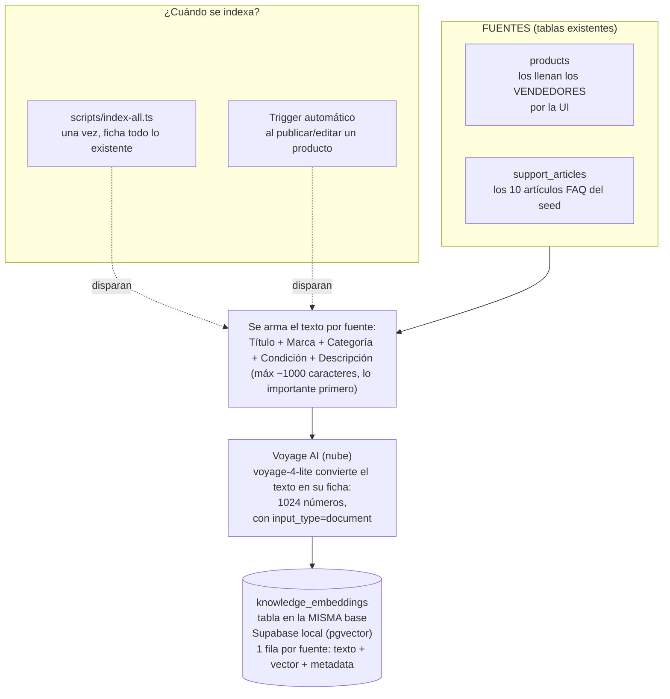
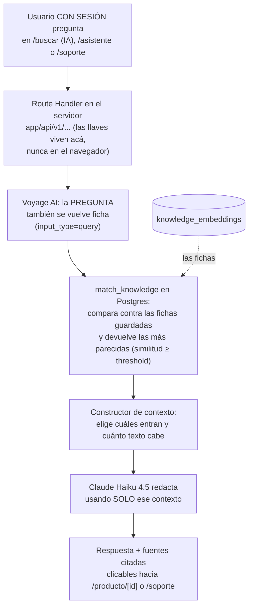

# RAG — MercadoTech

Evidencia de la Fase 4.8 (calibración, observabilidad y casos de prueba) de
[`MercadoTech_sesion4.md`](../MercadoTech_sesion4.md). Este documento no
agrega funcionalidad nueva: comprueba con datos reales que el asistente
ficha, encuentra y responde bien, documenta esa evidencia, y ajusta un
tunable (`lib/constants/ai.ts`) según lo que se midió — no según lo que
"se veía bien".

Está escrito para alguien que **no programó esto**: cada caso trae los
pasos exactos para repetirlo (qué escribir, dónde, qué deberías ver) y la
salida real que dio el sistema el día que se ejecutó esta evidencia
(2026-08-31, sobre Supabase local con el seed intacto más el producto de
prueba del caso 1).

---

## 1. Cómo funciona el flujo, en palabras simples

La analogía que gobierna toda la sesión 4 es la del **bibliotecario**
([`MercadoTech_sesion4.md`](../MercadoTech_sesion4.md), "Qué vas a
construir, en palabras simples"):

1. **Fichar (indexar).** Cada producto y cada artículo de la FAQ se
   convierte en una "ficha" numérica que resume su significado (un
   *embedding*, 1024 números). Pasa una vez al inicio (script) y luego
   automáticamente cada vez que un vendedor publica o edita un producto.
2. **Buscar por las fichas (recuperar).** La pregunta también se convierte
   en ficha, y la base de datos encuentra las fichas más *parecidas* — no
   las que comparten palabras, sino las que hablan de lo mismo.
3. **Responder solo con las fichas encontradas (generar).** Un modelo de
   lenguaje redacta la respuesta usando ÚNICAMENTE esas fichas, citándolas.
   Si ninguna ficha sirve, lo dice — nunca inventa. Eso es RAG:
   *Retrieval-Augmented Generation*.

**Pipeline 1 — Alimentación (indexar):**



**Pipeline 2 — Consulta (responder):**



No hay una "base de datos de IA" aparte: las fichas viven en la misma
Postgres de siempre, y son derivadas — se pueden reconstruir enteras
corriendo `scripts/index-all.ts` de nuevo.

---

## 2. Paso 1 — `scripts/index-all.ts`

**Cómo repetirlo:** con el servidor y Supabase local corriendo,

```bash
npx tsx scripts/index-all.ts
```

**Qué hace:** ficha (o re-ficha) todos los productos activos y artículos
publicados, uno por uno. La cuenta de Voyage de este laboratorio no tiene
método de pago, así que queda limitada a **3 peticiones por minuto** — el
script lo maneja solo (reintenta con espera de 21s hasta 3 veces por
ítem), tarda varios minutos en vez de segundos, y eso es esperado, no un
error.

**Salida real de esta ejecución:**

```
Productos indexados: 16
Artículos indexados: 10
Total: 26
```

**Verificación independiente (conteo en la base, no solo el log del
script):**

| Consulta | Resultado |
|---|---|
| `products` con `is_active = true` | 16 |
| `support_articles` con `is_published = true` | 10 |
| `knowledge_embeddings` (total de filas) | **26** ✅ coincide (16 + 10) |
| Fichas de producto huérfanas (`source_id` sin producto activo) | 0 |
| Fichas de artículo huérfanas | 0 |

`16 + 10 = 26 = 26`. Sin huérfanos: cada fila de `knowledge_embeddings`
apunta a una fuente real y activa/publicada.

---

## 3. Los 6 casos

Todos ejecutados con sesión real (`buyer1@mercadotech.test`) contra el
servidor local, sin mockear Voyage ni Claude.

### Caso 1 — Indexación automática

**Qué hacer:** iniciar sesión como vendedor (`seller1@mercadotech.test`) →
`/vendedor/publicar` → completar el formulario y publicar un producto
nuevo (con al menos una imagen).

**Qué se esperaba:** una fila nueva en `knowledge_embeddings`.

**Qué pasó:** se publicó "Teclado Mecánico Fase48 RGB Hot-Swap" (categoría
Gaming, S/ 349.00, id `c306be33-08ba-4058-b2db-9da5a258c4ac`). Segundos
después apareció su ficha:

```
source_type=producto  source_id=c306be33-08ba-4058-b2db-9da5a258c4ac  chunk_index=0
content: "Título: Teclado Mecánico Fase48 RGB Hot-Swap
          Marca: Fase48Test
          Categoría: Gaming
          Condición: nuevo
          Descripción: Teclado mecánico inalámbrico..."
metadata: {"title": "Teclado Mecánico Fase48 RGB Hot-Swap", "category": "Gaming", "condition": "nuevo"}
```

`knowledge_embeddings` pasó de 26 a **27** filas. ✅ El trigger
fire-and-forget de la Fase 4.3 (`triggerReindex` en `useProductForm.ts`)
funciona sin que el vendedor haga nada extra.

### Caso 2 — Recuperación semántica

**Qué hacer:** con sesión iniciada, ir a `/buscar?q=audífonos para el
gimnasio` → pestaña "Resultados con IA".

**Qué se esperaba:** productos de audio deportivo primero.

**Qué pasó** (equivalente por `curl` a `/api/v1/search/semantic`, misma
lógica que usa la pestaña):

| # | Producto | Similitud |
|---|---|---|
| 1 | Audífonos Sony WH-1000XM5 (cancelación de ruido) | 0.541 |
| 2 | Audífonos Logitech G435 Gaming Inalámbricos (livianos, para entrenar) | 0.537 |
| 3 | Parlante JBL Flip 6 (resistente al agua, IP67) | 0.452 |

✅ Los tres resultados son productos de audio relevantes para hacer
ejercicio (audífonos livianos/inalámbricos, parlante resistente al agua);
nada de laptops, procesadores ni monitores se coló en el top-3.

### Caso 3 — Respuesta contextual (compras)

**Qué hacer:** en `/asistente`, escribir **"laptop liviana para la
universidad"** y enviar.

**Qué se esperaba:** respuesta citando 2+ productos reales, con links.

**Qué pasó:**

> Para la universidad te recomiendo la **Laptop HP Pavilion 14" [1]**...
> Tiene Intel Core i5, 8GB de RAM y 512GB SSD... Si necesitás más potencia...
> la **Lenovo IdeaPad Slim 3 15.6" [2]** también es portátil, con más RAM
> (16GB) y mejor procesador (Ryzen 5)...

Fuentes: `[1]` Laptop HP Pavilion 14" → `/producto/b0000000-...-0002`,
`[2]` Laptop Lenovo IdeaPad Slim 3 → `/producto/b0000000-...-0001`. ✅ Cita
2 productos reales del catálogo, cada uno con su mini-card (imagen +
precio) y link al producto correcto (navegación verificada en el caso 6).

### Caso 4 — Respuesta contextual (soporte)

**Qué hacer:** en `/soporte`, escribir **"¿cómo devuelvo un producto?"**.

**Qué se esperaba:** respuesta basada en el artículo de devoluciones,
citado.

**Qué pasó:**

> Para devolver un producto, tenés hasta 7 días calendario desde que lo
> recibís [1]. Abrí un ticket de soporte indicando el número de pedido y el
> motivo... el producto debe estar sin usar, con su empaque original y
> todos sus accesorios. El costo del envío corre por tu cuenta, salvo que
> sea error del vendedor [1].

Fuente `[1]`: "¿Cuál es la política de devoluciones y cambios?"
(similitud 0.677) — el artículo correcto de los 10 de la FAQ. ✅ Ningún
dato inventado: los 7 días, el empaque original y quién paga el envío
están todos, literalmente, en ese artículo del seed.

### Caso 5 — Sin información

**Qué hacer:** escribir **"¿venden autos usados?"** tanto en `/asistente`
como en `/soporte`.

**Qué se esperaba:** admite que no hay resultados; en soporte, sugiere
ticket.

**Qué pasó:**

- **Compras:** *"No, no vendemos autos usados. MercadoTech es un
  marketplace de productos tecnológicos... ¿Hay algún producto tecnológico
  en el que pueda ayudarte?"* — `hasRelevantContext: false`,
  `retrievedCount: 0`, sin fuentes inventadas.
- **Soporte:** *"No, MercadoTech es un marketplace especializado en
  productos tecnológicos, no vendemos autos. Si tenés dudas... podés abrir
  un ticket de soporte y nuestro equipo te brindará más información."* —
  también `retrievedCount: 0`, y esta vez sí sugiere el ticket.

✅/⚠️ **Matiz documentado, no oculto:** se repitió esta consulta varias
veces durante la sesión (ver tabla de calibración) y la sugerencia
explícita de "abrí un ticket" en modo soporte **no aparece en el 100% de
las repeticiones** — una vez respondió correctamente que no vende autos
pero sin mencionar el ticket. `SUPPORT_SYSTEM_INSTRUCTIONS`
(`lib/ai/prompts.ts`, Fase 4.2) ya se lo pide explícitamente
("sugerí abrir un ticket de soporte"); esto es variabilidad normal de un
modelo de lenguaje (misma pregunta, misma instrucción, redacción distinta
cada vez), no un bug de código ni un problema de threshold —
`retrievedCount: 0` es correcto en las dos, así que no hay nada que
recuperar mejor. Diagnóstico según la tabla de síntomas (sección 5): fila
*"El chat responde pero sin fuentes"* → comportamiento esperado para una
pregunta fuera de catálogo/FAQ. Queda registrado como observación de
calidad de redacción, no como fix pendiente — esta fase no permite tocar
`lib/ai/prompts.ts` (solo constantes de `lib/constants/ai.ts`).

### Caso 6 — Navegación desde fuentes

**Qué hacer:** en `/asistente`, preguntar algo que traiga fuentes de
producto (ej. "quiero un mouse para gaming") y hacer clic en una fuente
citada.

**Qué se esperaba:** abre el producto correcto.

**Qué pasó:** la respuesta citó `[1] Mouse Razer DeathAdder V3
Inalámbrico`, `[2] Mouse Logitech G Pro X Superlight 2` y, entre las
fuentes recuperadas pero no citadas en el texto, `[3] Teclado Mecánico
Fase48 RGB Hot-Swap` — el producto del caso 1, ya buscable a los pocos
segundos de publicado. Se hizo clic en la mini-card `[3]` y el navegador
abrió `/producto/c306be33-08ba-4058-b2db-9da5a258c4ac`, mostrando título,
precio (S/ 349.00) y descripción exactos del producto recién publicado.
✅ El link de cada fuente apunta al `source_id` real, no a una URL
armada a mano.

---

## 4. Calibración

### Cómo se hizo

Se corrieron los 6 casos de arriba más 2 consultas legítimas extra y 2
consultas absurdas (10 en total) contra el threshold original (**0.3**,
heredado sin medir — ver el comentario "HIPÓTESIS de arranque" que traía
`lib/constants/ai.ts` antes de esta fase), leyendo el log estructurado que
imprime `app/api/v1/chat/route.ts` en cada consulta
(`retrievedCount`/`usedSourceCount`/`hasRelevantContext`) y anotando a
mano si la respuesta fue útil.

### Tabla de calibración (threshold 0.3, antes del cambio)

| # | Consulta | Modo | retrievedCount | usedSourceCount | ¿Respuesta útil? | Similitud de las fuentes (1er…5to) |
|---|---|---|---|---|---|---|
| 1 (caso 3) | "laptop liviana para la universidad" | compras | 5 | 5 | ✅ sí — cita las 2 laptops correctas | 0.604, 0.570, **0.357, 0.340, 0.317** |
| 2 (caso 4) | "¿cómo devuelvo un producto?" | soporte | 5 | 5 | ✅ sí — cita el artículo correcto | 0.678, 0.582, 0.563, 0.442, 0.424 |
| 3 (caso 5) | "¿venden autos usados?" | compras | 0 | 0 | ✅ sí — admite que no vende, sin inventar | — |
| 4 (caso 5) | "¿venden autos usados?" | soporte | 0 | 0 | ✅ sí (esta repetición sugirió ticket) | — |
| 5 (caso 2, vía chat) | "audífonos para el gimnasio" | compras | 3 | 3 | ✅ sí — los 3 son audio/deportivo | 0.541, 0.537, 0.452 |
| 6 (extra legítima) | "quiero un mouse para gaming" | compras | 5 | 5 | ✅ sí — cita los 2 mouse correctos | 0.685, 0.682, **0.419, 0.408, 0.408** |
| 7 (extra legítima) | "¿puedo pagar contra entrega?" | soporte | 5 | 5 | ✅ sí — cita el artículo correcto | 0.648, 0.447, 0.421, 0.412, 0.411 |
| 8 (absurda) | "¿tienen envío a la luna?" | compras | 0 | 0 | ✅ sí — no inventa un servicio inexistente | — |
| 9 (absurda) | "cuéntame un chiste" | soporte | 0 | 0 | ✅ sí — redirige a temas de soporte | — |
| 10 (caso 2, ranking puro) | "audífonos para el gimnasio" | `/search/semantic` | 3 resultados | — | ✅ sí — orden correcto (audio antes que nada más) | 0.541, 0.535, 0.451 |

**Negrita** = fuentes que entraron al contexto pero son ruido: en la
consulta 1, un SSD, unos audífonos gaming y un procesador aparecen como
"fuente" de una pregunta sobre laptops; en la consulta 6, una consola
PS5 y un monitor aparecen como "fuente" de una pregunta sobre mouses.
Ninguna de esas 6 fuentes de ruido fue citada por Claude en el texto de
la respuesta (siempre citó solo `[1]`/`[2]`, nunca `[3]`–`[5]`) — el
modelo las ignoró correctamente, pero igual viajaron en el contexto
(costo de tokens) y quedaron expuestas como "fuente" en la UI aunque no
se mencionaran.

### Lectura de la tabla

- **Ninguna consulta legítima devolvió 0 fuentes.** Las 6 consultas con
  intención real (1, 2, 5, 6, 7, y el caso 2 por ranking) siempre trajeron
  al menos 3 resultados relevantes → **no hace falta bajar el threshold.**
- **Sí entra ruido** en las consultas que llenan el tope de 5 resultados
  (1, 6, y en menor medida 2 y 7): la cola de resultados 3°–5° cae en el
  rango **0.32–0.45** de similitud y, en los casos más claros (1 y 6), no
  tiene relación real con lo preguntado.
- **La fuente relevante con similitud más baja que Claude citó en
  cualquiera de las 10 consultas fue 0.452** (el parlante JBL en la
  consulta 5/10, "audífonos para el gimnasio"). Ninguna fuente por debajo
  de eso fue citada nunca.

### Decisión

**Se sube el threshold de 0.3 a 0.4** (ambas constantes,
`VECTOR_SEARCH_DEFAULT_SIMILARITY_THRESHOLD` y
`CONTEXT_BUILDER_DEFAULT_MIN_SIMILARITY`, que comparten valor por diseño
desde la Fase 4.2). Es un ajuste conservador, no agresivo: 0.4 deja un
margen de 0.05 por debajo de la fuente relevante más baja jamás citada
(0.452), suficiente para no arriesgar falsos negativos, pero por encima
de toda la cola de ruido claro observada en la consulta 1 (0.317–0.357).
No se subió más (ej. a 0.45) porque eso habría estado pisando el límite
de la fuente relevante más baja observada — objetivo de esta calibración
es reducir ruido con evidencia, no maximizar la poda.

### `lib/constants/ai.ts` — cambio aplicado

```diff
- export const VECTOR_SEARCH_DEFAULT_SIMILARITY_THRESHOLD = 0.3;
+ export const VECTOR_SEARCH_DEFAULT_SIMILARITY_THRESHOLD = 0.4;

- export const CONTEXT_BUILDER_DEFAULT_MIN_SIMILARITY = 0.3;
+ export const CONTEXT_BUILDER_DEFAULT_MIN_SIMILARITY = 0.4;
```

(Los comentarios de ambas constantes se reescribieron para documentar
esta medición en vez de la "hipótesis de arranque" original — ver el
archivo.)

### Casos re-ejecutados después del cambio (0.4)

| # | Consulta | Modo | retrievedCount ANTES → DESPUÉS | ¿Cambió la respuesta? |
|---|---|---|---|---|
| 1 (caso 3) | "laptop liviana para la universidad" | compras | 5 → **2** | No en el contenido citado (seguía citando solo HP [1] y Lenovo [2]) — desaparece el ruido (SSD, audífonos, procesador) |
| 2 (caso 4) | "¿cómo devuelvo un producto?" | soporte | 5 → 5 | No — la cola de esta consulta (0.42–0.44) queda justo por encima de 0.4, sin cambios |
| 5 (caso 2, chat) | "audífonos para el gimnasio" | compras | 3 → 3 | No — todas sus fuentes ya estaban por encima de 0.4 |
| 10 (caso 2, semantic) | "audífonos para el gimnasio" | `/search/semantic` | 3 → 3 | No — mismo motivo |
| 6 (extra) | "quiero un mouse para gaming" | compras | 5 → 5 | No — su cola (0.408–0.419) también queda justo por encima de 0.4 |
| 7 (extra) | "¿puedo pagar contra entrega?" | soporte | 5 → 5 | No — misma razón |
| 3 (caso 5) | "¿venden autos usados?" | compras | 0 → 0 | No (sanity check, sin cambio esperado) |
| 4 (caso 5) | "¿venden autos usados?" | soporte | 0 → 0 | No (sanity check, sin cambio esperado) |

**Resultado honesto:** el efecto medido de 0.3→0.4 fue más chico de lo
que un cálculo rápido sobre la tabla original hacía pensar — de las 8
consultas re-ejecutadas, **solo la consulta 1 cambió** (5→2 fuentes),
porque las colas de ruido de las otras (0.408–0.447) resultaron estar
apenas por encima de 0.4, no por debajo. El cambio sigue siendo correcto
y con evidencia real detrás (elimina el caso de ruido más claro de las 10
consultas, sin tocar ninguna respuesta legítima ni crear un solo falso
negativo), pero es una poda más conservadora de lo que parecía a primera
vista — exactamente el tipo de cosa que esta fase pide medir en vez de
asumir.

---

## 5. Tabla de síntomas y diagnóstico

(De `MercadoTech_sesion4.md`, para tenerla a mano sin volver a la spec.)

| Síntoma | Causa más probable | Qué hacer |
|---|---|---|
| Error 401 en el chat | `ANTHROPIC_API_KEY` ausente, mal copiada o revocada | Revisar la variable en `.env.local`; reiniciar `npm run dev` tras cambiarla (el server lee el entorno al arrancar) |
| Error 401 al indexar o buscar | `VOYAGE_API_KEY` ausente, mal copiada o revocada | Misma revisión, pero sobre la otra llave. Que falle una sola de las dos es normal: son proveedores independientes |
| Error 400 en el chat | Modelo mal escrito, o se coló `effort`/`thinking` (Guía, lección 4) | Verificar que el id sea exactamente `claude-haiku-4-5` sin sufijo de fecha, y que la llamada no mande `output_config` ni `thinking` |
| Error 429 / "rate limit" | Ráfaga de llamadas, o crédito agotado en Anthropic | Esperar y reintentar. Si es de Claude, revisar el saldo en console.anthropic.com; si es de Voyage, la cuota gratis de 200M tokens es difícil de agotar en este laboratorio |
| La búsqueda IA devuelve resultados mediocres aunque haya fichas | `input_type` mal usado (Guía, lección 2): se indexó y se buscó con el mismo valor | Confirmar `'document'` al indexar y `'query'` al buscar. No da error, solo empeora — por eso hay que mirarlo a propósito |
| La pestaña IA nunca trae resultados | No se corrió `index-all` (tabla vacía) o threshold muy alto | Contar filas de `knowledge_embeddings` en Studio; si hay 0 → correr el script; si hay filas → bajar el threshold y recargar |
| La búsqueda IA trae cosas sin relación | Threshold muy bajo | Subirlo en `lib/constants/ai.ts` y documentar en `docs/RAG.md` |
| El chat responde pero sin fuentes | El contexto llegó vacío (`hasRelevantContext: false`) | Es el comportamiento correcto para preguntas fuera del catálogo/FAQ; si pasa con preguntas legítimas → calibración (esta fase) |
| Embeddings fallan pero el chat funciona (o viceversa) | Son DOS proveedores distintos: Voyage por `fetch`, Claude por SDK | Es lo esperable, no un bug. Leer el mensaje: `lib/ai/` siempre nombra cuál de los dos falló |
| Publicar un producto no crea su ficha | El trigger es best-effort y el server no ve `VOYAGE_API_KEY` | Buscar el `console.warn` en la terminal del server; correr `index-all` como plan B |

---

## 6. Resumen para quien no leyó todo lo anterior

- `index-all` fichó exactamente lo esperado: 16 productos + 10 artículos =
  26 filas, sin huérfanos.
- Los 6 casos de la spec pasan, con evidencia real (transcripciones y
  logs) pegada arriba — incluida la única observación real encontrada
  (la sugerencia de ticket en modo soporte no es 100% consistente, por
  variabilidad del modelo, no por un bug).
- El threshold de similitud se midió con 10 consultas reales y se subió
  de **0.3 a 0.4** en `lib/constants/ai.ts` — reduce ruido en el contexto
  sin generar ningún falso negativo, y el efecto real (medido, no
  estimado) quedó documentado arriba.
- Nada de esto tocó código de negocio: el único cambio no-documental fue
  ese ajuste de dos constantes.

---

## 7. Addendum post-cierre — consultas genéricas sin contexto (2026-08-31)

Este caso apareció recién en uso real, DESPUÉS de cerrar la Fase 4.8 — se
documenta acá porque es la misma clase de problema (calibración del RAG),
aunque el fix terminó siendo de prompt, no de threshold.

### Síntoma reportado

Usando `/asistente` con preguntas genéricas de catálogo —
**"qué productos tienes?"** y **"qué productos me recomiendas de tu
catálogo"** — el asistente respondía cosas como:

> No tengo información sobre qué productos están disponibles en el
> catálogo de MercadoTech en este momento. Para poder recomendarte
> productos, necesitaría que me compartas el listado con los detalles de
> lo que tenemos disponible...

Le pedía el catálogo AL USUARIO, que obviamente tampoco lo tiene — un
sinsentido de cara al que está probando el asistente, que además no sabe
si es un problema de conexión, de sesión, o de datos.

### Diagnóstico (antes de tocar nada)

**No era un problema de conexión ni de sesión** — el endpoint respondía
200 las cuatro veces, sin errores de Voyage ni de Claude
(`metadata.model` presente en las cuatro respuestas). Se generaron los
embeddings reales de las dos preguntas y se corrió la búsqueda contra
`knowledge_embeddings` con `similarity_threshold: 0` (sin filtrar nada,
para ver el paisaje completo) usando `services/vector-search.service.ts`
directamente desde un script de scratchpad (no comprometido al repo):

| Consulta | Mejor similitud encontrada | Top 3 |
|---|---|---|
| "qué productos tienes?" | 0.367 | Audífonos Logitech G435, PS5, Router TP-Link |
| "qué productos me recomiendas de tu catálogo" | 0.399 | Router TP-Link, Audífonos Logitech G435, Audífonos Sony |

Ningún producto pasa de **0.40** para ninguna de las dos preguntas — es
esperable: una pregunta sin ningún tema puntual ("qué tienes" en general)
no tiene con qué "parecerse" semánticamente más que cualquier otro
producto, así que nada se destaca. Con el threshold de la Fase 4.8
(**0.4**, ver sección 4), `match_knowledge` devuelve correctamente 0
filas — el sistema funcionaba como estaba calibrado, el problema era otro:
qué le decían las instrucciones de sistema al modelo cuando el contexto
llega vacío.

### Decisión

Se le presentaron 4 opciones a quien reportó el síntoma (bajar threshold
a 0.35, dejar 0.4 y arreglar el prompt, ambas, o volver a 0.3). Elegida:
**dejar el threshold en 0.4 tal cual quedó calibrado en la Fase 4.8, y
arreglar `lib/ai/prompts.ts`** — el pedido explícito fue que el asistente
nunca sonara como si no tuviera catálogo ni le pidiera datos al usuario,
sino que preguntara por el tipo de producto e insistiera hasta tener algo
concreto que buscar.

### Fix aplicado

`lib/ai/prompts.ts`, `SHOPPING_SYSTEM_INSTRUCTIONS` — se agregó:
"tenés acceso real al catálogo, una búsqueda puntual puede no encontrar
coincidencia" como marco general, y una regla explícita para el caso de
contexto vacío: nunca decir que no hay acceso al catálogo ni pedirle el
listado al usuario — en su lugar, preguntar qué tipo de producto busca
(con opciones concretas: laptops, celulares, accesorios, gaming...) o
qué marca/precio/característica tiene en mente, e insistir hasta lograr
algo específico. `lib/constants/ai.ts` **no se tocó** — ningún tunable
cambió.

### Verificación (mismo escenario del síntoma, en vivo)

- **"qué productos tienes?"** → el asistente ya NO dice que no tiene
  catálogo. Responde con una lista de categorías reales del negocio
  (laptops, celulares, tablets, accesorios, periféricos, gaming) y pide
  precisar marca/precio/característica.
- Respuesta de seguimiento **"accesorios para gaming"** → `retrievedCount`
  pasó de 0 a 5, y el asistente recomendó productos reales con cita:
  Mouse Logitech G Pro X Superlight 2 `[2]`, Mouse Razer DeathAdder V3
  `[4]`, Teclado Mecánico Fase48 RGB Hot-Swap `[5]`, Audífonos Logitech
  G435 `[1]`.
- `npm run lint` y `npm run type-check` limpios tras el cambio.

**No es deuda técnica pendiente** — quedó resuelto y verificado; se
documenta acá por trazabilidad, no como un pendiente para la sesión 5.
