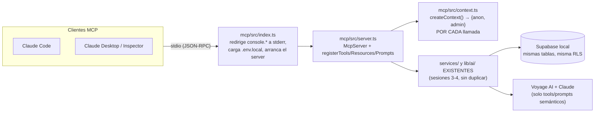

# mcp/ — Servidor MCP de MercadoTech

Servidor [MCP](https://modelcontextprotocol.io) (Model Context Protocol) que
expone MercadoTech a cualquier cliente MCP (Claude Code, Claude Desktop, el
Inspector, el agente de voz de la sesión 8) por **stdio**. Es de **solo
lectura**: ninguna tool ni resource crea, edita ni borra nada.

No cocina nada nuevo. Cada tool/resource/prompt reutiliza los `services/` y
`lib/ai/` que ya existen en el proyecto web (sesiones 3-4) — este README
documenta CÓMO se conecta ese código existente al protocolo, no lógica de
negocio nueva.

## Qué expone

- **10 Tools** — trámites con parámetros (buscar productos, comparar,
  preguntarle al asistente, etc.).
- **7 Resources** — folletos con URI estable (`mercadotech://products`,
  `mercadotech://faq`, ...) que un cliente lee directamente.
- **5 Prompts MCP** — formularios pre-armados que embeben datos reales para
  que el modelo del CLIENTE los procese (nunca llaman a un proveedor de IA
  por su cuenta).

Ver la tabla completa de las tres cosas más abajo.

## Arquitectura



`mcp/src/shared/` guarda las **derivaciones**: composiciones de services
existentes cuando ningún service solo ya devuelve la forma que necesita una
tool/resource (ej. "productos por lote de ids", "categorías con conteo").
Están documentadas ahí mismo, archivo por archivo, con el porqué.

## Decisiones (con su porqué)

**Contexto por llamada, no al arrancar.** `createContext()` (`src/context.ts`)
se invoca DENTRO de cada handler, nunca una sola vez al iniciar el proceso.
El servidor vive horas como proceso de larga duración; un cliente creado una
única vez quedaría con su estado de conexión congelado. Cada llamada fabrica
`{anon, admin}` frescos.

**`console.log`/`info`/`warn` → `stderr`, como línea 1 de `index.ts`.** Con
transporte stdio, **stdout transporta JSON-RPC** — un solo `console.log` sin
redirigir corrompe la sesión completa. La redirección es la primera línea
ejecutada del proceso, y todo lo demás (incluido el SDK) se importa
DINÁMICO (`await import(...)`) adentro de `main()`: un `import` estático se
evalúa ANTES de que corra cualquier línea del cuerpo del archivo (se
"hoistea"), así que si CUALQUIER dependencia transitiva hiciera un
`console.log` a nivel de módulo, se ejecutaría antes de la redirección y
igual corrompería stdout. El import dinámico garantiza el orden real.

**Por qué NO importa `lib/supabase/admin.ts`.** La spec de esta sesión da
por cierto que ese archivo importa el paquete `server-only` (que solo el
bundler de Next neutraliza) y que por eso "revienta bajo Node puro" — se
verificó línea por línea contra el archivo real de este repo y **eso no es
cierto**: `lib/supabase/admin.ts` no importa `server-only` en absoluto, y
`scripts/index-all.ts` (sesión 4) ya lo usa directo bajo `tsx` sin ningún
problema, siempre que `.env.local` esté cargado primero. La razón REAL para
que `mcp/` construya sus propios clientes (`@supabase/supabase-js` directo,
mismas opciones que `admin.ts`: sin autorefresh, sin persistencia de
sesión) es otra, y sigue siendo válida: `admin.ts` documenta en su propia
cabecera que solo debe importarse desde Route Handlers, Server Actions o
`scripts/` — la lista cerrada de "código server de Next". Sumar `mcp/` a
esa lista acoplaría el servidor MCP a una convención pensada para la app
web; construir el cliente acá logra el mismo resultado sin esa dependencia
cruzada.

**anon vs admin, por tool/resource — nunca "admin para todo".** Ver la
tabla completa más abajo; regla general: `anon` respeta RLS y alcanza para
todo lo que ya es público (catálogo, categorías, FAQ, reseñas); `admin` es
la excepción, documentada junto a cada registro, para las tres RLS que
exigen sesión/rol que el MCP no tiene (`knowledge_embeddings` exige
`authenticated`; `orders`/`order_items` exigen ser el comprador/vendedor/
admin; `profiles` no tiene SELECT público).

**`.env.local` de la RAÍZ, no una propia de `mcp/`.** `mcp/src/env.ts`
(`loadEnvLocal()`) parsea la MISMA `.env.local` del proyecto web con
`process.loadEnvFile` — mismo patrón que `scripts/index-all.ts` (sesión 4):
Next.js la carga solo al arrancar, un proceso Node/tsx standalone no. Una
sola fuente de credenciales, nunca un `.env` duplicado dentro de `mcp/`.

**Cast `as unknown as ...Callback<Shape>` en `define-tool.ts`/`define-prompt.ts`.**
Es un gotcha real de TypeScript, no un escape de tipos flojo: dentro de una
función GENÉRICA (`defineTool<Shape>`, `definePrompt<Shape>`), el
compilador no puede probar que un callback armado a partir de un `Shape`
todavía ABSTRACTO satisface la sobrecarga del SDK para ESE `Shape` — se
verificó con un archivo de prueba aparte que la llamada DIRECTA (sin el
wrapper genérico) compila limpia sin ningún cast. Cada `tools/*.ts` /
`prompts/*.ts` real llama a estos helpers con un `Shape` CONCRETO, así que
ahí el type-check sí es real; el cast cubre solo la implementación
genérica de los dos helpers.

**Los argumentos de los Prompts MCP son SIEMPRE string — por protocolo, no
por elección.** `GetPromptRequestParams.arguments` es `{[key: string]:
string}` en el spec del SDK: un cliente MCP nunca puede mandarle un array a
un Prompt. Se descubrió probando `comparar_productos` con el Inspector (un
`z.array(z.string())` como `argsSchema` nunca recibe un valor real) — el
argumento `ids` es un string separado por comas, parseado y validado (2-4)
dentro del handler. Las Tools SÍ aceptan JSON arbitrario en sus argumentos
(`tools/call` es distinto de `prompts/get`); por eso `compare_products`
(la tool) sigue usando un array de verdad.

## Variables de entorno

Ninguna propia — reutiliza la `.env.local` de la raíz del repo (ver
`CLAUDE.md`, "Variables de entorno"). Las que `mcp/src/env.ts` valida como
obligatorias al arrancar:

| Variable | La usa |
|---|---|
| `NEXT_PUBLIC_SUPABASE_URL` | `context.ts`, ambos clientes |
| `NEXT_PUBLIC_SUPABASE_ANON_KEY` | `context.ts`, cliente `anon` |
| `SUPABASE_SERVICE_ROLE_KEY` | `context.ts`, cliente `admin` |

Además, indirectamente (vía `lib/ai/` del proyecto web, sin que `mcp/` las
lea directo): `VOYAGE_API_KEY` (tools/prompts semánticos) y
`ANTHROPIC_API_KEY` (`ask_assistant`, `summarize_reviews`). Si faltan, esas
tools puntuales devuelven un error claro — el servidor entero sigue vivo
(ver tabla de síntomas).

## Comandos

Todos se corren **desde `mcp/`**, salvo el arranque real del servidor (ese
sí, desde la RAÍZ del repo — ver más abajo):

```bash
npm run dev          # tsx watch src/index.ts — reinicia solo al guardar
npm run build         # tsup → mcp/dist/ (bundle ESM, target node20)
npm run start           # node dist/index.js — corre el build de producción
npm run type-check        # tsc --noEmit sobre mcp/tsconfig.json
```

**Arrancar el servidor** (dev, con `tsx`) — SIEMPRE desde la raíz del repo,
nunca desde dentro de `mcp/`: el alias `@/*` y la carga de `.env.local`
asumen ese directorio de trabajo.

```bash
npx tsx mcp/src/index.ts
```

Queda esperando por stdio sin imprimir nada en stdout — es el comportamiento
correcto, no un cuelgue.

**Producción**, después de `npm run build` dentro de `mcp/`:

```bash
node mcp/dist/index.js
```

(también desde la raíz — mismo motivo).

## Cómo probarlo

**MCP Inspector** (sin Claude Code, útil para depurar una tool/resource
puntual):

```bash
npx @modelcontextprotocol/inspector npx tsx mcp/src/index.ts
```

Abre una UI web local; conectar con el switch de la fila del servidor. Modo
CLI, para un solo método sin abrir el navegador (lo que se usó para toda la
evidencia de este documento):

```bash
npx @modelcontextprotocol/inspector --cli npx tsx mcp/src/index.ts --method tools/list
npx @modelcontextprotocol/inspector --cli npx tsx mcp/src/index.ts --method tools/call --tool-name search_products --tool-arg search=laptop
npx @modelcontextprotocol/inspector --cli npx tsx mcp/src/index.ts --method resources/read --uri "mercadotech://faq"
npx @modelcontextprotocol/inspector --cli npx tsx mcp/src/index.ts --method prompts/get --prompt-name describir_producto --prompt-args productId=<uuid>
```

**Claude Code**, vía `.mcp.json` en la raíz del repo (ya commiteado) —
requiere **reiniciar la sesión** para que lo lea, y aprobar el servidor la
primera vez que lo pregunte. Verificar con `/mcp`.

## Tools (10)

| # | Tool | Reutiliza | Cliente | Por qué ese cliente |
|---|---|---|---|---|
| 1 | `search_products` | `product.service.listActiveProducts` | anon | `products_select_active_or_own` es público |
| 2 | `get_product` | `shared/products.getProductDetail` (→ `getProductById`+`getProductImages`+`question.service.listByProduct`) | anon | ídem |
| 3 | `list_categories` | `shared/stats.getCategoriesWithCounts` | anon | `categories_select_all` es público |
| 4 | `semantic_search_products` | `vector-search.service.searchProducts` | **admin** | `knowledge_embeddings_select_authenticated` exige `authenticated`; el MCP no tiene sesión |
| 5 | `ask_assistant` | `chat.service.ask` | **admin** | ídem (usa `searchKnowledge` por dentro) |
| 6 | `compare_products` | `shared/products.getProductsByIds` | anon | mismas policies que #1/#2 |
| 7 | `find_related_products` | `lib/ai/embeddings` + `vector-search.service.searchByEmbedding` | **admin** | ídem #4 |
| 8 | `summarize_reviews` | `review.service.listByProduct` + `lib/ai/completion.generateCompletion` | anon | `reviews_select_all` es público (el `generateCompletion` no necesita RLS) |
| 9 | `get_store_stats` | `shared/stats.getStoreStats` | anon + **admin** | categorías/total: público; top vendidos lee `order_items` (solo comprador/vendedor/admin) |
| 10 | `get_order_status` | `order.service.getOrderById` | **admin** | `orders`/`order_items` solo permiten comprador/vendedor-con-ítems/admin; el MCP no tiene sesión de comprador |

Las 4 tools semánticas (#4, #5, #7, y la mitad de #9) degradan con un
mensaje accionable si falta `VOYAGE_API_KEY`/`ANTHROPIC_API_KEY` — nunca
tumban el servidor (`lib/errors.ts`, `ProviderDownError`).

## Resources (7)

| URI | Tipo | Reutiliza | Cliente |
|---|---|---|---|
| `mercadotech://info` | estático | — (texto fijo) | — |
| `mercadotech://products` | estático | `product.service.listActiveProducts` | anon |
| `mercadotech://products/{id}` | template (con `list`) | `shared/products.getProductDetail` (misma que la tool #2) | anon |
| `mercadotech://categories` | estático | `shared/stats.getCategoriesWithCounts` (misma que la tool #3) | anon |
| `mercadotech://sellers/{sellerId}` | template (con `list`) | `shared/sellers.{getSellerProfile,listSellerIds}` | **admin** |
| `mercadotech://faq` | estático | `shared/faq.listPublishedArticles` | anon |
| `mercadotech://stats` | estático | `shared/stats.getStoreStats` (misma que la tool #9) | anon + **admin** |

`sellers/{sellerId}` expone ÚNICAMENTE `display_name` + productos activos
— la consulta en `shared/sellers.ts` ni siquiera pide `phone`/`avatar_path`
(no es "se ocultan al responder": no se traen de la base). Cliente admin
porque `profiles` no tiene SELECT público (`profiles_select_own_or_admin`).

Cada resource está envuelto en `safeRead`/`safeList`
(`lib/safe-resource.ts`): un resource caído nunca tumba `resources/list`
completo ni una lectura puntual — devuelve su error como texto legible.

## Prompts MCP (5)

*(Nunca confundir con las Skills de Claude Code — viven en capas distintas:
el Prompt lo sirve este servidor por protocolo, la Skill la carga Claude
Code desde `.claude/skills/`.)*

| Prompt | Argumento(s) | Embebe |
|---|---|---|
| `describir_producto` | `productId` | `shared/products.getProductDetail` |
| `comparar_productos` | `ids` (string, ids separados por coma — ver decisión arriba) | `shared/products.getProductsByIds` |
| `redactar_respuesta_pregunta` | `questionId` | `shared/questions.getQuestionWithProduct` |
| `resumen_de_resenas` | `productId` | `review.service.listByProduct` (crudo — el prompt NO llama a Claude, a diferencia de la tool #8) |
| `generar_articulo_faq` | `tema` | `shared/faq.listPublishedArticles` (como referencia de estilo) |

Ningún prompt llama a un proveedor de IA por su cuenta: son formularios que
un cliente arma con datos reales embebidos, para que el modelo del cliente
los procese — no motores.

## Si algo falla: síntomas y diagnóstico

(De `MercadoTech_sesion5.md`, con una fila agregada por lo que se encontró
de verdad probando este servidor.)

| Síntoma | Causa más probable | Qué hacer |
|---|---|---|
| Claude Code no ve el servidor / no aparece en `/mcp` | `.mcp.json` recién creado, sesión vieja, o no se aprobó el servidor | Reiniciar la sesión de Claude Code; aprobar el servidor cuando lo pregunte |
| El Inspector conecta pero "se cae" al primer uso | Algo escribió en stdout | Buscar un `console.log` sin redirigir — los logs van a stderr |
| Error de tipos/validación al registrar tools | zod 4 instalado | Pinnear `zod@^3.25.76` en `mcp/package.json` y reinstalar |
| "This module cannot be imported…" al arrancar | Algo importó `lib/supabase/admin.ts` | El MCP construye sus propios clientes en `src/context.ts`; revisar imports |
| "Faltan NEXT_PUBLIC_SUPABASE_URL…" | Node no carga `.env.local` solo | Verificar que `env.ts` corre ANTES de crear contexto y que se lanza desde la RAÍZ del repo |
| Tools semánticas devuelven vacío siempre | Se usó cliente anon contra `knowledge_embeddings` | Esas tools usan el cliente `admin` del contexto |
| Tools semánticas fallan con 401/modelo | `VOYAGE_API_KEY`/`ANTHROPIC_API_KEY` ausente o modelo rotado | Misma tabla de síntomas de la sesión 4 (`docs/RAG.md`) |
| `Cannot find module '@/services/…'` | Se lanzó desde otra carpeta, o el alias no resuelve | Lanzar `npx tsx mcp/src/index.ts` desde la RAÍZ; en build, revisar `tsup.config.ts` |
| Un resource devuelve `"[object Object]"` en vez de un mensaje | El error que tiró Supabase no es una instancia real de `Error` (típico en fallos de conexión) | Ya resuelto acá: `lib/errors.ts` exporta `getErrorMessage()`, que revisa `.message` de cualquier objeto antes de caer a `String()` — usarla siempre en un `catch`, nunca `error instanceof Error ? error.message : String(error)` a secas |
| Un Prompt con un argumento tipo array nunca recibe el valor | `GetPromptRequestParams.arguments` es `{[key: string]: string}` por protocolo — los Prompts MCP no aceptan arrays | Usar un string parseable (ej. separado por comas) como argumento, nunca `z.array(...)` en un `argsSchema` de Prompt |
| Las Skills no se activan | Sesión sin reiniciar tras crearlas, o `description` sin disparadores claros | Reiniciar sesión; la descripción debe decir CUÁNDO usarla con ejemplos de peticiones |

## Deuda técnica y limitaciones conocidas

- **Cuenta de Voyage sin método de pago** (límite real de 3 peticiones por
  minuto, sesión 4) — pruebas manuales que disparen varias tools semánticas
  seguidas pueden toparse con el límite; esperar ~20s y reintentar.
- **`shared/stats.getCategoriesWithCounts` es N+1** a propósito (una
  consulta por categoría) — aceptable con 8 categorías, no escalaría a
  cientos sin una agregación real.
- **`resources/products/{id}`'s `list` recorre hasta 5 páginas** (60
  productos) para enumerar instancias — acotado, no exhaustivo si el
  catálogo creciera mucho más.
- **Sin tests automatizados** — llegan en la sesión 6 (`mcp/package.json`
  no tiene un script `test` todavía; el validator de la Fase 5.1 ya lo
  contempla como "N/A hasta la sesión 6").
